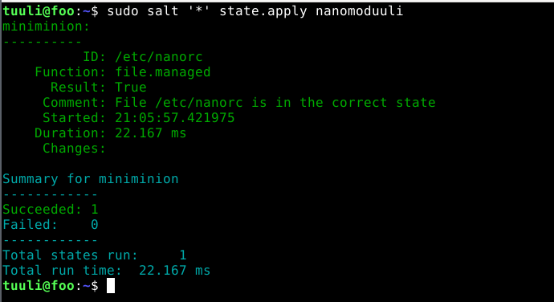
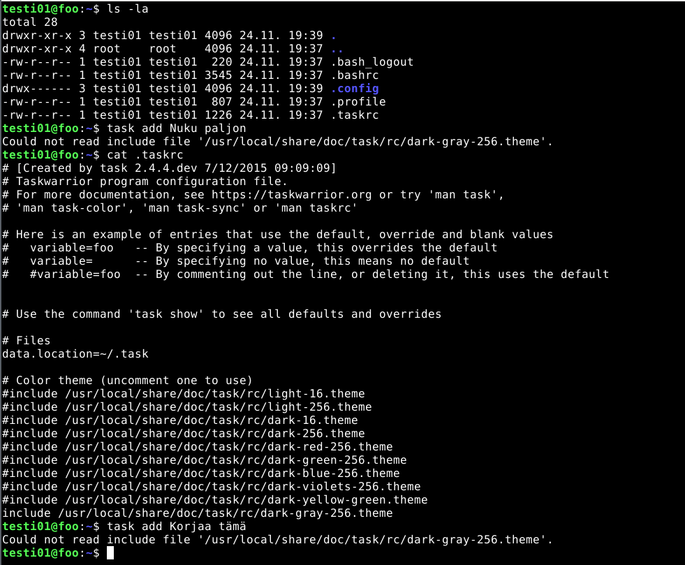
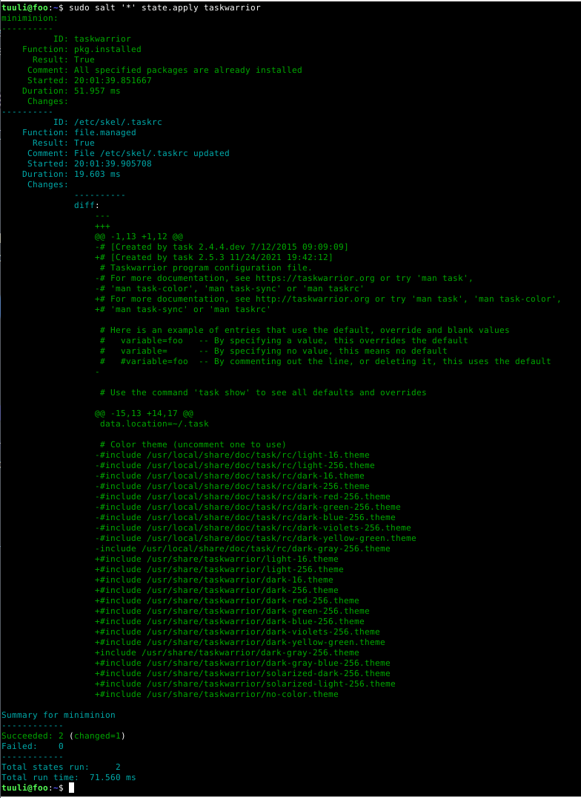
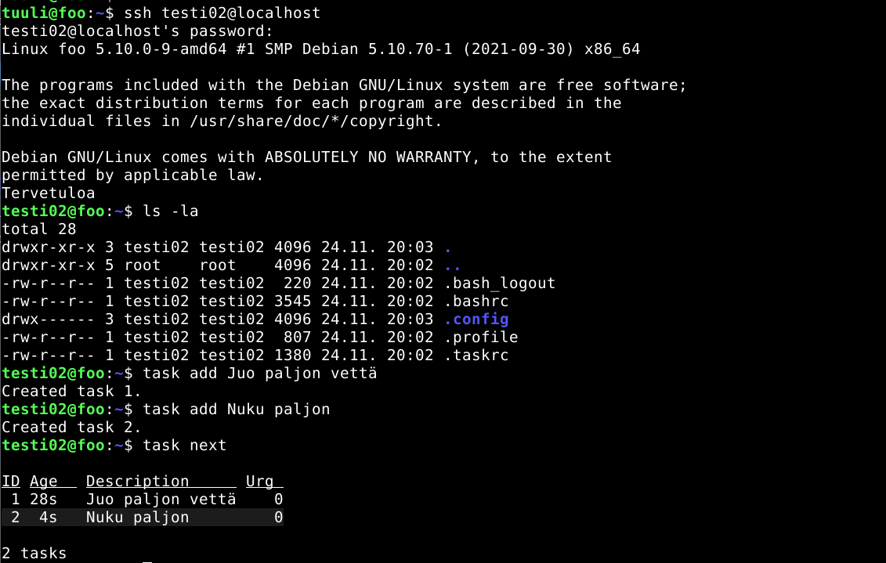

# Palvelinten hallinta - h4: Aikajana

Tämä harjoitus on osa Tero Karvisen pitämää Palvelinten hallinta ICT4TN022-3014 -kurssia
Haaga-Helia ammattikorkeakoulussa syksyllä 2021.

Tein harjoituksen tiistaina 23.11.2021. Koneena oli Lenovo Yoga Slim 7 -kannettava
Windows 11 -käyttöjärjestelmällä ja koneelle asennetun Oracle VirtualBox (6.1) -kautta
Debian 11 “bullseye”.

Harjoitus perustuu Tero Karvisen antamaan ohjeistukseen, joka löytyy
[kurssisivulta](https://terokarvinen.com/2021/configuration-management-systems-palvelinten-hallinta-ict4tn022-2021-autumn/)
Harjoituksen välivaiheiden tiedot perustuvat Teron Karvisen antamiin
ohjeistuksiin, ellei lähdettä ole toisin merkitty.

## Tehtävät

**a) Captain obvious. Linuxissa on paketinhallinta, joten ohjelmien asentaminen on yksinkertaista. Tee tila, joka asentaa 10 suosikkiohjelmaasi paketinhallinnasta. Tässä a-kohdassa voit jättää ohjelmat oletusasetuksille.**

Harjoituksen alkaessa koneelle oli asennettu Salt, master ja minion. Loin `/srv/salt/kymmenenohjelmanmoduuli/init.sls ` -tiedoston, johon tein seuraavalaisen ohjelmoinnin:

```	
default_10_pkgs:
  pkg.installed:
    - pkgs:
      - thunderbird
      - git
      - pandoc
      - synaptic
      - libreoffice
      - gedit
      - newsboat
      - vlc
      - filezilla
      - calibre
```

Thunderbird on sähköpostiohjelma, Git versionhallinta, Pandocilla voi 
konvertoida tiedostoja eri muotoihin, Synaptic on ohjelma graafisena käyttöliittymänä, jolla voi hallita paketinhallintaa,
Libreoffice on tekstinkäsittelyohjelmisto, Gedit on tekstieditori, Newsboat on uutissyöteohjelma, 
VLC on mediasoitin, Filezilla on tiedonsiirtoon tarkoitettu ohjelma ja Calibre e-kirjojen lukuohjelma.

Ajoin tilan komennolla `sudo salt '*' state.apply kymmenenohjelmanmoduuli` eli kaikille (tässä tapauksessa yhdelle) minioneille.


Ajo meni onnistuneesti läpi:  `Comment: 10 targeted packages were installed/updated`. Muutoksista näkee yksitellen jokainen asennettu ohjelma ja asennetun ohjelman versio.

**b) CSI Pasila. Tiedostoista saa aikajanan 'cd /etc/; sudo find -printf '%T+ %p\n'|sort|tail'.**

* **Anna esimerkki aikajanasta**


Tulosteesta nähdään: 
* Päivämäärä ja aika, jolloin muutos on tehty
* En ole varma numerosarjasta, onko se muutokselle annettu tunniste (numerosarja)?
* Kohde, jota on muokattu


* **Selitä jokainen kohta komennosta, jolla aikajana tehdään. Vinkki: '%T+' löytyy 'man find' kohdasta printf.**


* `cd /etc/;` siirrytään /etc -hakemistoon, josta löytyy usein ohjelmistojen asennustiedostot
* `sudo` tarvitaan sudo-oikeudet, jotta pystytään tarkastelemaan aikajanaa
* `find -printf` find on komento, jolla etsitään ja -printf on tulostusformaatti, jossa tuloste halutaan
* `'%T+%p\n'` %T tulostaa ajan ja päivämäärän, jolloin tiedostoa on muokattu, %p tulostaa tiedostonimen ja \n tarkoittaa välilyöntiä
* `|sort|tail` sort järjestää päivämäärän mukaan listan niin, että uusin tulee alimmaiseksi ja tail näyttää listauksen 10 viimeisintä riviä

* **Aja jokin komento, joka muuttaa järjestelmän yhteisiä asetustiedostoja**
* **Ota uusi aikajana ja etsi muutos sieltä**
* **Onko samalla hetkellä muutettu yhtä vai useampaa tiedostoa?**

Muutin `/etc/skel/.bashrc` tiedostoa lisäten loppuun `echo "Tervetuloa"`. Lisäyksen on tarkoitus tulostaa "Tervetuloa" -teksti, kun käyttäjä kirjautuu koneelle.

Tämän jälkeen ajoin /etc/ -hakemistossa `sudo find -printf '%T+ %p\n'|sort|tail`ja kun alla olevaa tulostetta vertaa edelliseen esimerkkikuvaan komennon antamasta syötteestä, loppuun ilmestyi tieto tekemästäni muutoksesta.


Tulosteesta myös näkee, että yhtä tiedostoa on vain muutettu.

**c) Tiedän mitä teit viime kesän^H^H^H komennolla. Säädä jotain ohjelmaa ja etsi sen muuttamat tiedostot aikajanasta. Tee sitten tästä oma Saltin tila.**

Päädyin tekemään muutoksia Nano -tekstieditoriin. Olin aikaisemmin pohtinut, miten saisin wrapattua tekstin ja rivinumerot näkyviin. Löysin seuraavan ohjeen: [Configuring Nano Text Editor with nanorc](https://linuxhint.com/configure_nano_text_editor_nanorc/). Ohjeen mukaisesti muutin tekstin wrappausta, laitoin rivinumerot näkyviin ja lisänä löysin kohdan, jolla tabulaattorin matkan pystyi muuttamaan neljästä välilyönnistä kahteen, jota ajattelin kokeilla kokeilemisen ilosta.

Muutin tiedostoa `/etc/nanorc` johon tein seuraavat muutokset:

``` 
set linenumbers
set softwrap
set tabsize 2
```

Hain komennolla `sudo find -printf '%T+ %p\n'|sort|tail` aikajanan, jonka lopusta huomaa, että tein muutoksia nnanorc -tiedostoon:


Tämän jälkeen tein muutoksista Salt -tilan. Loin hakemiston `/srv/salt/nanomoduuli`, johon loin `init.sls` -tiedoston, jossa määräsin hakemaan Nanon asetustiedoston `nanorc` Saltista, eli tästä nano -moduulista:

```
 1 /etc/nanorc:
 2   file.managed:
 3     - source: salt://nanomoduuli/nanorc
```

Tämän jälkeen kopioin `/etc/nanorc` tiedoston `/srv/salt/nanomoduuli` -hakemistoon. Koska Nanon asetustiedostooli tällä hetkellä identtinen sekä saltin tilassa, että koneessa, koska kone oli sekä master, että minion, ei tilan ajo näyttäisi mitään muutoksia. Siksi ennen ajoa menin tekemään `/etc/nanorc` tiedostoon muutoksen, ja poistin kohdan `set tabsize 2`. Tämän jälkeen ajoin komennon `sudo salt '*' state.apply nanomoduuli`. 



Tulosteesta näkee, että muutoksia `/etc/nanorc` -tiedostoon on tehty: `+set tabsize 2`. Eli äsken koneelta poistamani asetus ajettiin takaisin, sillä se löytyi Salt-tilasta.  

**25.11.2021 Edit:** Tässä harjoituksessa olisi pitänyt ensin kokeilla muutokset paikallisesti, ennen ajamista kaikille. Lisäksi paikallisesti olisi pitänyt ensin testata, että muutokset toimivat. Selventävä kuva lopputuloksesta puuttuu myös.

**d) Asenna jokin toinen ohjelma asetuksineen.**

Tein tämän harjoituksen keskiviikkona 24.11.2021. Tutkin eri ohjelmia ja päädyin asentamaan [Taskwarrior](https://taskwarrior.org):in, joka on nimensä mukaisesti on ohjelma, johon voi laittaa to-do tehtäviä ja hallinnoida niitä. Ensin loin `/srv/salt/taskwarrior`-hakemiston, johon loin tiedoston `init.sls` ja ohjelmoin tiedoston asentamaan Taskwarriorin sekä hakemaan Taskwarriorin asetustiedoston `.taskrc` hakemistosta `/srv/salt/taskwarrior`. 

```
$ sudoedit /srv/salt/taskwarrior/init.sls

 1 taskwarrior:
 2   pkg.installed
 3
 4 /etc/skel/.taskrc:
 5   file.managed:  
 6     - source: salt://taskwarrior/.taskrc
```

Seuraavaksi loin `.taskrc` -tiedoston. Löysin [Taskwarriorin dokumentaatiosta](https://taskwarrior.org/docs/introduction.html) pohjan configure -tiedostolle. Sivulta ilmenee myös, että `.taskrc` tiedosto sijaitsee käyttäjän kotihakemistossa eli `~/.taskrc`. Tästä päättelin, että jos haluan configure -tiedostoon tehdä muutoksia niin, että ne tulevat jokaiselle uudelle käyttäjälle, minun on sijoitettava se `/etc/skel` -hakemistoon. 


Tässä harjoituksessa kokeilin pelkästään muuttaa Taskwarriorin teemaa, eli asetin teemaksi `include /usr/local/share/doc/task/rc/dark-gray-256.theme`

```
# [Created by task 2.4.4.dev 7/12/2015 09:09:09]
# Taskwarrior program configuration file.
# For more documentation, see https://taskwarrior.org or try 'man task',
# 'man task-color', 'man task-sync' or 'man taskrc'

# Here is an example of entries that use the default, override and blank values
#   variable=foo   -- By specifying a value, this overrides the default
#   variable=      -- By specifying no value, this means no default
#   #variable=foo  -- By commenting out the line, or deleting it, this uses the default


# Use the command 'task show' to see all defaults and overrides

# Files
data.location=~/.task

# Color theme (uncomment one to use)
#include /usr/local/share/doc/task/rc/light-16.theme
#include /usr/local/share/doc/task/rc/light-256.theme
#include /usr/local/share/doc/task/rc/dark-16.theme
#include /usr/local/share/doc/task/rc/dark-256.theme
#include /usr/local/share/doc/task/rc/dark-red-256.theme
#include /usr/local/share/doc/task/rc/dark-green-256.theme
#include /usr/local/share/doc/task/rc/dark-blue-256.theme
#include /usr/local/share/doc/task/rc/dark-violets-256.theme
#include /usr/local/share/doc/task/rc/dark-yellow-green.theme
include /usr/local/share/doc/task/rc/dark-gray-256.theme

```

Tämän jälkeen loin uuden käyttäjän `testi01` ja kirjauduin sisään ssh:lla `ssh testi01@localhost`. Uuden käyttäjän sen takia, että `/etc/skel` hakemistosta kopioidaan sisältö aina uuden käyttäjän kotihakemistoon. Katsoin testikäyttäjän kotihakemiston listauksen, ja sinne oli luotu `.taskrc`. Kokeilin luoda uuden taskin komennolla `task add`, mutta kuten allaolevasta kuvasta näkee, en pystynyt.

 

Syöte antaa virheilmoituksen `Could not read include file '/usr/local/share/doc/task/rc/dark-gray-256.theme`. Seuraavaksi poistin testi01 -käyttäjältä `.taskrc` -tiedoston ja kokeilin lisätä uudestaan `task add`-komennolla taskin. Tällöin ohjelma kertoi, ettei `.taskrc` -tiedostoa löydy ja luodaanko sellainen:

```
A configuration file could not be found in 

Would you like a sample /home/testi01/.taskrc created, so Taskwarrior can proceed? (yes/no) 

```

Vastasin yes ja katsoin luodun `.taskrc` -tiedoston sisällön. Ymmärsin, että minun järjestelmässä teemat viedäänkin hakemistoon `/usr/share/taskwarrior/`, joten päätin kopioida kyseisen `/home/testi01/.taskrc`-tiedoston ja päivittää sen Salt-tilasta löytyvään `.taskrc`-tiedostoon:

```
$ sudoedit /srv/salt/taskwarrior/.taskrc`
# [Created by task 2.5.3 11/24/2021 19:42:12]
# Taskwarrior program configuration file.
# For more documentation, see http://taskwarrior.org or try 'man task', 'man task-color',
# 'man task-sync' or 'man taskrc'

# Here is an example of entries that use the default, override and blank values
#   variable=foo   -- By specifying a value, this overrides the default
#   variable=      -- By specifying no value, this means no default
#   #variable=foo  -- By commenting out the line, or deleting it, this uses the default

# Use the command 'task show' to see all defaults and overrides

# Files
data.location=~/.task

# Color theme (uncomment one to use)
#include /usr/share/taskwarrior/light-16.theme
#include /usr/share/taskwarrior/light-256.theme
#include /usr/share/taskwarrior/dark-16.theme
#include /usr/share/taskwarrior/dark-256.theme
#include /usr/share/taskwarrior/dark-red-256.theme
#include /usr/share/taskwarrior/dark-green-256.theme
#include /usr/share/taskwarrior/dark-blue-256.theme
#include /usr/share/taskwarrior/dark-violets-256.theme
#include /usr/share/taskwarrior/dark-yellow-green.theme
include /usr/share/taskwarrior/dark-gray-256.theme
#include /usr/share/taskwarrior/dark-gray-blue-256.theme
#include /usr/share/taskwarrior/solarized-dark-256.theme
#include /usr/share/taskwarrior/solarized-light-256.theme
#include /usr/share/taskwarrior/no-color.theme
```

Tämän jälkeen ajoin komennon `sudo salt '*' state.apply taskwarrior` ja kuten tulosteesta näkee, muutokset tehtiin `/etc/skel/.taskrc`-tiedostoon:

 

Tämän jälkeen loin uuden testikäyttäjän `testi02` ja kirjauduin sisään ssh-yhteydellä. Ensimmäiseksi tarkistin, onko `.taskrc` -tiedosto luotu kotihakemistoon ja siellä se oli. Tämän jälkeen testasin komennolla `task add` toimiiko Taskwarrior ja toimi! Sain lisättyä taskeja. Lopulta komennolla `task next` sain yhteenvedon taskeista ja samalla näin, että haluttu teema oli käytössä:



Tarinan opetus oli se, että minun olisi pitänyt ensin testata `.taskrc` -tiedoston ja Taskwarriorin toimintaa paikallisesti ennen Saltilla automatisointia, mutta sain asian suhteellisen helposti korjattua. Ongelmaksi tässä lienee se, ettei `/etc/skel`:in kautta päivitys ilmeisesti päivity jo olemassa oleville käyttäjille? Edit: 25.11.2021. Se ei itse asiassa ole ongelma, sillä tarkoitus ei ole muutenkaan muuttaa jo olemassaolevien käyttäjien tekemiä omia asetustiedostoja (aiheuttaa hämmennystä), joten parempi ajaa muutokset jatkossa uusille käyttäjäille, kuten tässä harjoituksessa tein.

**25.11.2021 Edit:**  Eli ennen tilan ajoa kaikille minioneille, olisin voinut testata paikallisesti joko ihan puhtaasti omassa kotihakemistossani Taskwarriorin toimintaa ja `~/.tascr`-tiedoston asetuksien muokkaamista tai paikallisesti Salt-tilaa  komennolla `sudo salt --local state.apply taskwarrior`ja testata, että halutukset muutokset toimii ja vasta tämän jälkeen ajaa muutokset kaikille. 
