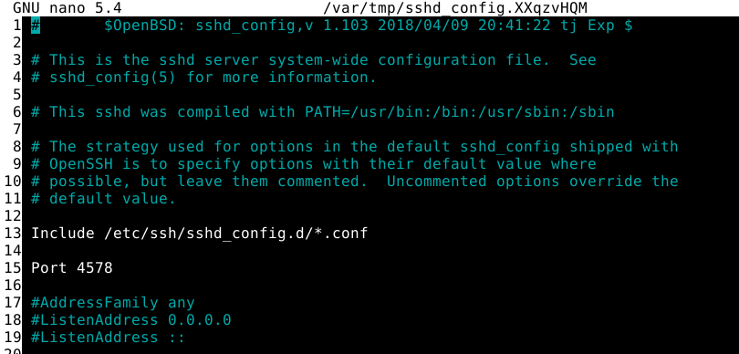

# Palvelinten hallinta - h5: Demonit

Tämä harjoitus on osa Tero Karvisen pitämää Palvelinten hallinta ICT4TN022-3014 -kurssia Haaga-Helia ammattikorkeakoulussa syksyllä 2021.

Tein harjoituksen tiistaina 30.11.2021. Koneena oli Lenovo Yoga Slim 7 -kannettava Windows 11 -käyttöjärjestelmällä ja koneelle asennetun Oracle VirtualBox (6.1) -kautta Debian 11 “bullseye”.

Harjoitus perustuu Tero Karvisen antamaan ohjeistukseen, joka löytyy [kurssisivulta](https://terokarvinen.com/2021/configuration-management-systems-palvelinten-hallinta-ict4tn022-2021-autumn/). Harjoituksen välivaiheiden tiedot perustuvat Teron Karvisen antamiin ohjeistuksiin, ellei lähdettä ole toisin merkitty.

* **Master -koneena seuraavissa harjoituksissa on VirtualBoxissa pyörivä Debian 11 (debian1)**
* **Minion -koneita on 2: yksi Debian 11 (debian2) ja yksi Ubuntu server 20.40.03 LTS (ubuntus1)**

**a) Watch it! Asenna Saltilla SSHD asetuksineen. Lisää ssh-demonille ylimääräinen portti. Osoita testein, että uusi portti toimii. Vaihda porttia masterilla olevasta asetustiedoston mallista (/srv/salt/sshd/sshd_config tms), aja tila orjille, ja osoita testein, että palvelin käynnistyy jos ja vain jos asetustiedoston malli masterilla on muuttunut. Vinkki: Karvinen 2018: Pkg-File-Service – Control Daemons with Salt – Change SSH Server Port**

Aloitin harjoituksen luomalla `/srv/salt/ssh` -hakemiston master -koneelle, eli debian1:seen. Loin hakemistoon `init.sls` tiedoston, johon loin seuraavanlaisen ohjelmoinnin:

```
$sudoedit /srv/salt/ssh/init.sls
  
 1 openssh-server:
 2   pkg.installed
 3
 4 /etc/ssh/sshd_config:
 5   file.managed:
 6     - source: salt://ssh/sshd_config
 7
 8 sshd:
 9   service.running:
10     - enable: True
11     - watch:
12       - file: /etc/ssh/sshd_config

```

* Rivit 1-2: asennetaan openssh-server demoni
* Rivit 4-6: rivillä 4 on miniolle tarkoitettu polku tiedostolle, joka kopioidaan polusta, joka on rivillä 6. Rivillä 6 oleva polku tiedostolle `sshd_config`, joka  sijaitsee `/srv/salt/ssh/`-hakemistossa, eli Saltin "juuressa". Eli käytännössä luodaan konfiguraatiotiedosto sshd:lle, joka sijoitetaan Saltin juureen, josta se kopioidaan ajossa halutuille minioneille. 
* Rivit 8-12: Varmistetaan, että demoni on päällä. Rivi 8 sshd tarkoittaa ssh-demonia.Rivillä 10 `service.running`, rivillä 10 `enable: True` varmistaa, että demoni on päällä. Rivillä 11 `watch` tarkoittaa, että se seuraava rivi 12 `file:`seuraa rivillä 4 olevaa komentoa, eli tässä tapauksessa sitä, missä Saltin sshd:lle tarkoitettu konfiguraatiotiedosto sijaitsee.

Minulla oli openssh jo asennettuna masterille, joten testasin sitä komennolla `ssh tuuli@localhost` ja sain vastaukseksi:

```
tuuli@debian1:~$ ssh tuuli@localhost
tuuli@localhost's password: 
Linux debian1 5.10.0-9-amd64 #1 SMP Debian 5.10.70-1 (2021-09-30) x86_64

The programs included with the Debian GNU/Linux system are free software;
the exact distribution terms for each program are described in the
individual files in /usr/share/doc/*/copyright.

Debian GNU/Linux comes with ABSOLUTELY NO WARRANTY, to the extent
permitted by applicable law.
Last login: Tue Nov 30 10:14:19 2021 from ::1
```

Eli ssh toimi master -koneessa. Seuraavaksi hain masterilta ssh:n asetustiedoston polusta `/etc/ssh/sshd_config`. En ollut tehnyt siihen vielä muutoksia. Kopioin master -koneella olevan asetustiedoston sellaisenaan Saltin juureen komennolla `sudo cp /etc/ssh/sshd_config /srv/salt/ssh/`. Seuraavaksi avasin kopioidun tiedoston `/srv/salt/ssh/sshd_config` ja vaihdoin sshd:n portin oletusportista 22 porttiin 4578:



Tämän jälkeen tallensin `/srv/salt/ssh/sshd_config` -tiedoston. Tässä vaiheessa kopioin master -koneella olevan `/etc/ssh/sshd_config` -tiedoston backupiksi, sillä seuraavaksi kokeilin ajaa Saltin ssh-moduulin ensin masterilla katsoakseni, miten se toimii ennen minioneille ajoa. Eli tein seuraavan komennon: `cp /etc/ssh/sshd_config /etc/ssh/sshd_config_backup` ja tarkistin, että kopio löytyy halutusta kohdehakemistosta. Tämän jälkeen ajoin Salt-tilan paikallisesti pelkästään masterilla komennolla:

```
tuuli@debian1:~$ sudo salt-call --local state.apply ssh
```


Syötteestä näin, että `Succeeded: 3 (changed=2)` eli ajo meni onnistuneesti läpi ja muutoksia tuli kaksi. Tila ei asentanut openssh-serveriä, sillä se oli jo asennettuna masterilla. Sen sijaa se oli poistanut portin 22 ja lisännyt portin 4578 tiedostoon `/etc/ssh/sshd_config`. Lisäksi demoni oli käynnistetty uudelleen `ID: sshd`-kohdassa. 

Seuraavaksi kokeilin toimivuutta vielä järjestelmässä. Tein ensin masterilla testin uudelleen, jossa hain ilman spesifioitua porttia ssh-yhtyettä localhostiin: 

```
tuuli@debian1:~$ ssh tuuli@localhost
ssh: connect to host localhost port 22: Connection refused
```

Eli oletusporttiin 22 ei saatu yhteyttä. Seuraavaksi kokeilin äsken asettamallani uudella portilla:

```
tuuli@debian1:~$ ssh tuuli@localhost -p 4578
tuuli@localhost's password: 
Linux debian1 5.10.0-9-amd64 #1 SMP Debian 5.10.70-1 (2021-09-30) x86_64

The programs included with the Debian GNU/Linux system are free software;
the exact distribution terms for each program are described in the
individual files in /usr/share/doc/*/copyright.

Debian GNU/Linux comes with ABSOLUTELY NO WARRANTY, to the extent
permitted by applicable law.
Last login: Tue Nov 30 10:37:24 2021 from ::1
```

Eli porttiasetukset olivat menneet läpi. Halusin kuitenkin, että master -kone käyttää oletusporttia, joten kopioin backup -tiedoston takaisin: `sudo mv /etc/ssh/sshd_config_backup /etc/ssh/sshd_config`. Käynnistin ssh:n uudelleen järjestelmästä ja testasin jälleen uutta ssh:n porttia ja nyt portti oli jälleen oletus 22.

Seuraavaksi ajoin tilan minioneille. Minionit ubuntus1 ja debian2 oli "tyhjiä", joten niille en ollut asentanut muuta kuin salt-minionin ja luonut yhteyden masteriin. Ensin testasin yhteyden masterilta minioneille:

```
tuuli@debian1:~$ sudo salt '*' test.ping
debian2:
    True
ubuntus1:
    True
```

Eli yhteys oli voimassa. Seuraavaksi ajoin tilan kaikille minioneille komennolla:

```
tuuli@debian1:~$ sudo salt '*' state.apply ssh --state-output=terse
```

Kohta `--state-output=terse` tiivistää komennosta tulevaa syötettä.


Syötteestä näin, että puhuin palturia aikaisemmin. Ilmeisesti ubuntus1:sessä olikin openssh-server asennettuna, sillä muutoksia tuli vain kaksi (olisi pitänyt tulla kolme, eli myös asentaa ssh). Debian2:seen sen sijaan tuli kolme muutosta, eli kaikki kohdat suoritettiin. Seuraavaksi testasin yhteyttä masterilta. Ensin hain minioneiden IP-osoitteet:

```
tuuli@debian1:~$ sudo salt '*' cmd.run 'hostname -I'
debian2:
    192.168.1.190 fda0:d807:620f:f800:abea:f895:8599:6455 2001:14bb:440:2c0:d403:755e:96e2:b4fe
ubuntus1:
    192.168.1.186 fda0:d807:620f:f800:a00:27ff:fe7a:1b2b 2001:14bb:440:2c0:a00:27ff:fe7a:1b2b
```

Tämän jälkeen kokeilin suoraan muutettuun porttiin ja IP-osoitteeseen ssh-yhteyksiä

```
tuuli@debian1:~$ ssh tuuli@192.168.1.190 -p 4578
tuuli@debian1:~$ ssh tuuli@192.168.1.186 -p 4578
```

Ei onnistunut. Nopeasti tajusin, että kyse on todennäköisesti palomuurista. Olin asentanut palomuurit minioneihin päälle alkukonfiguraatiossa. Ajattelin harjoituksen vuoksi kokeilla, saisinko suoraan masterilta muutettua minioneiden palomuuriasetuksia menemättä minioneille avaamaan ssh:lle asettamaani uutta porttia. Löysin [Teemu Karhusen tekemän harjoituksen](https://teemukarhunencom.wordpress.com/2020/12/14/h7-oma-moduli/), jota käytin pohjana seuraavaan.

Tarkistin, miltä masterin porttitilanne näytti:

```
tuuli@debian1:~$ sudo ufw status
Status: active

To                         Action      From
--                         ------      ----
22/tcp                     ALLOW       Anywhere                  
4505                       ALLOW       Anywhere                  
4506                       ALLOW       Anywhere                  
22/tcp (v6)                ALLOW       Anywhere (v6)             
4505 (v6)                  ALLOW       Anywhere (v6)             
4506 (v6)                  ALLOW       Anywhere (v6) 
```

22/tcp on ssh:n oletusportti ja portit 4505-4506 ovat Saltin käytössä. Päätin avata myös hetkellisesti masterilla portin 4578, jotta saisin asetustiedostot kopioitua uuteen Salt -tilaan. Palomuuriasetuksien tiedostot ja mitä muokataan:

```
/etc/ufw/ufw.conf # Määrittää, onko palomuuri päällä vai ei
/etc/ufw/user.rules # IPv4 palomuurisäännöt
/etc/ufw/user6.rules #IPv6 palomuurisäännöt
```

Koska olin muokkaamassa sääntöjä, otin backupkopioit tiedostoista `/etc/ufw/user.rules`ja `/etc/ufw/user6.rules`. Tämän jälkeen poistin masterilla Saltin käyttämät portit ja 22/tcp:n ja hyväksyin portin 4578:


Ensin tarkistin porttitilanteen, jonka jälkeen resetoin koko palomuurin. Ilmeisesti järjestelmä tekee itsekin varmuuskopiot tässä vaiheessa (ylläolevassa kuvassa). Tämän jälkeen tarkistin, ettei portteja ollut ja järjestelmä ilmoittaa, ettei tulimuuri ole päällä. Tämän jälkeen päivitin portin 4578/tcp ja laitoin palomuurin päälle, jonka jälkeen tutkin tilannetta. Nyt asetukset ovat sellaiset, mitkä haluaisin ajaa minioneille. Käytin apuna tässä kohtaa ohjetta: [How to Delete rules in UFW Ubuntu Firewall using ufw delete command](https://www.configserverfirewall.com/ufw-ubuntu-firewall/ufw-delete-rule/). 

Seuraavaksi teen Salt-tilan polkuun `/srv/salt/ufw/` ja kopioin alla olevat tiedostot. Lisäksi päivitin backup-tiedostot masterille ja tarkistin, että vanhat porttiasetukset tulivat voimaan takaisin:

```
tuuli@debian1:~$ sudo mkdir -p /srv/salt/ufw
tuuli@debian1:~$ sudo cp /etc/ufw/ufw.conf /srv/salt/ufw/
tuuli@debian1:~$ sudo cp /etc/ufw/user.rules /srv/salt/ufw/
tuuli@debian1:~$ sudo cp /etc/ufw/user6.rules /srv/salt/ufw/
tuuli@debian1:~$ sudo cp /etc/ufw/user.rules_backup /etc/ufw/user.rules
tuuli@debian1:~$ sudo cp /etc/ufw/user6.rules_backup /etc/ufw/user6.rules
tuuli@debian1:~$ sudo ufw status
Status: active

To                         Action      From
--                         ------      ----
22/tcp                     ALLOW       Anywhere                  
4505                       ALLOW       Anywhere                  
4506                       ALLOW       Anywhere                  
22/tcp (v6)                ALLOW       Anywhere (v6)             
4505 (v6)                  ALLOW       Anywhere (v6)             
4506 (v6)                  ALLOW       Anywhere (v6)    
```

Lopuksi kirjoitin `/srv/salt/init.sls` tiedoston: (Ohjelmoinnin lähde: [Teemu Karhusen tekemää moduuli](https://teemukarhunencom.wordpress.com/2020/12/14/h7-oma-moduli/), ohjelmointi on sama, sillä siinä on kaikki mitä tarvitsen tässä harjotuksessa).

```
 1 /etc/ufw/ufw.conf:
 2   file.managed:
 3     - soruce: salt://ufw/ufw.conf
 4
 5 /etc/ufw/user.rules:
 6   file.managed:
 7     - source: salt://ufw/user.rules
 8
 9 /etc/ufw/user6.rules:
10   file.managed:     
11     - source: salt://ufw/user6.rules
12
13 ufwservice:
14   service.running:
15     - name: ufw
16     - watch: 
17       - file: /etc/ufw/ufw.conf
18       - file: /etc/ufw/user.rules
19       - file: /etc/ufw/user8.rules
```

* Rivi 1: Lukee tiedoston, josta palomuuri laitetaan päälle
* Rivi 5: Lukee tiedoston, jossa on palomuurisäännöt IPv4
* Rivi 9: Lukee tiedoston, jossa on palomuurisäännöt IPv6
* Rivi 13: Katsoo, että palomuuri on päällä ja tarkkailee ID:tä riviltä 1, 5 ja 9.

Ensin ajoin paikallisesti:


Yksi muutos ei mennyt läpi. `Name: ufw - Function: service.running - Result: Failed Started`, eli tila ei saanut käynnistettyä palomuuria. Lisäksi alussa on varoitus: `[WARNING ] State for file: /etc/ufw/ufw.conf - Neither 'source' nor 'contents' nor 'contents_pillar' nor 'contents_grains' was defined, yet 'replace' was set to 'True'. As there is no source to replace the file with, 'replace' has been set to 'False' to avoid reading the file unnecessarily.` Hetken tarkasteltuani huomaan kirjoitusvirheen rivillä 3 = `- soruce: salt://ufw/ufw.conf`. Korjasin kirjoitusvirheen ja mietin, mikä ongelma service.running:issa voisi olla. Nyt init.sls -tiedosto ei esim. asenna palomuuria, vaan päivittää vain säännöt. Lisäksi `sudo ufw status` komennolla saa vastauksen `inactive`, jos palomuuri ei ole päällä. Koska tämä harjoitus alkoi paisua vähän muualle, päätin jättää asian tulevaisuudessa tutkittavaksi ja poistin service.running -kohdan ja jätin tiedoston niin, että se vain päivittää säännöt, jotta pääsin harjotuksessa eteenpäin. Lopullinen asetustiedosto:

```
 1 /etc/ufw/ufw.conf:
 2   file.managed:
 3     - source: salt://ufw/ufw.conf
 4
 5 /etc/ufw/user.rules:
 6   file.managed:
 7     - source: salt://ufw/user.rules
 8
 9 /etc/ufw/user6.rules:
10   file.managed:
11     - source: salt://ufw/user6.rules
```

Ajoin tilan paikallisesti ja kaikki ok. Tarkistin vielä masterilla:

```
tuuli@debian1:~$ sudo ufw status
Status: active

To                         Action      From
--                         ------      ----
4578/tcp                   ALLOW       Anywhere                  
4578/tcp (v6)              ALLOW       Anywhere (v6)             

```

Tässä välissä palautin jälleen backupit masterille, tarkistin tilanteen ja seuraavaksi ajoin minioneille:


Ei mennyt läpi. Enää ei ollut ollenkaan yhteyttä minioneihin muutenkaan, testasin komennolla `salt '*' test.ping`. 

Päätin käsin mennä debian2:selle, konfiguroida portit ja kokeilla ssh-yhteyttä, jotta saisin loputkin harjoitukset tehtyä:


Tämän jälkeen sain ssh-yhteyden debian2:seen:

```
tuuli@debian1:~$ ssh tuuli@192.168.1.190 -p 4578
tuuli@192.168.1.190's password: 
Linux debian2 5.10.0-9-amd64 #1 SMP Debian 5.10.70-1 (2021-09-30) x86_64

The programs included with the Debian GNU/Linux system are free software;
the exact distribution terms for each program are described in the
individual files in /usr/share/doc/*/copyright.

Debian GNU/Linux comes with ABSOLUTELY NO WARRANTY, to the extent
permitted by applicable law.
Last login: Mon Nov 29 21:44:24 2021 from 192.168.1.189
tuuli@debian2:~$ 
```

**b) Securerer shell. Tee Saltin kautta jokin muu sshd:n asetus ja osoita, että se toimii. Siivoa sshd_configista turhat kommenttirivit. Laita tiedostoon kommentti, jossa varoitetaan, että tiedosto ylikirjoittuu automaattisesti. Liitä siivottu sshd_config vastaukseesi.**

Tässä vaiheessa harjoitusta en saanut enää yhteyttä minioneihin, joten päätin palata harjoituksen alussa olevaan master-koneeseen ja minion-koneeseen debian2 (en ollut epähuomiossa ottanut ubuntus1- snapshottia, joten jätin sen pois jatkosta).

Kun yhteydet olivat kunnossa (master: debian1, minion: debian2). Jatkoin harjoitusta niin, että minulla oli luotuna `/srv/salt/ssh`-hakemisto, jossa oli edellisestä harjoituksesta init.sls ja muokkaamaton sshd_config -tiedosto.

Päätin lisätä bannerin, joten lisäsin `/srv/salt/ssh/sshd_config` tiedostoon kohdan: `Banner /etc/ssh/sshd-banner`, jonka jälkeen loin `/srv/salt/ssh/sshd-banner` tiedoston, johon kirjoitin "Tämä on banneri". Apuna käytin seuraavaa ohjetta: [HowTo: Set a Warning Message (Banner) in SSH](https://www.shellhacks.com/setup-warning-message-banner-ssh/).  Tämän jälkeen muokkasin init.sls -tiedoston näyttämään seuraavalta:

```
 1 openssh-server:
 2   pkg.installed
 3
 4 /etc/ssh/sshd_config:
 5   file.managed:
 6     - source: salt://ssh/sshd_config
 7
 8 /etc/ssh/sshd-banner:
 9   file.managed:
10     - source: salt://ssh/sshd-banner
11 
12 sshd:
13   service.running:
14     - enable: True
15     - watch:
16       - file: /etc/ssh/sshd_config
```

Tämän jälkeen siivosin vielä `/srv/salt/sshd_config`-tiedoston tunnilla näytetyllä tavalla. Ennen siivousta otin tiedostosta kopion.

```
cat sshd_config |grep -v ^#|grep -v ^$| sudo tee sshd_configtmp sudo mv sshd_configtmp sshd_config
```

* cat sshd_config = lukee tiedoston sisällön
* grep -v ^# = valitsee kaikki risuaidat ja poistaa ne
* grep -v ^$ = valitsee kaikki tyhjät rivivaihdot ja poistaa ne
* sudo tee sshd_configtmp = tekee tuon nimisen tiedoston ja kirjoittaa sinne cat -tuloste (joka tässä tulee ilman risuaitoja ja rivivälejä)
* sudo mv  = siirtää väliaikaisen tiedoston sisällön oikeaan

Lopulta `/srv/salt/ssh/sshd_config` tiedosto näytti tältä:

```
 1 Include /etc/ssh/sshd_config.d/*.conf
 2 ChallengeResponseAuthentication no
 3 UsePAM yes
 4 X11Forwarding yes
 5 PrintMotd no
 6 Banner /etc/ssh/sshd-banner
 7 AcceptEnv LANG LC_*
 8 Subsystem       sftp    /usr/lib/openssh/sftp-server
```

Tämän jälkeen testasin paikallisesti:

```
sudo salt-call --local state.apply ssh
```

 

Bannerin tekstiohjaus ei mennyt läpi. Jostain syystä ko. tiedostoa ei ollut Saltin juuressa. No, tein sen uudestaan sinne. Ajoin uudelleen paikallisesti tilan:

```
tuuli@debian1:~$ sudo salt-call --local state.apply ssh --state-output=terse
local:
  Name: openssh-server - Function: pkg.installed - Result: Clean Started: - 19:34:10.807279 Duration: 55.166 ms
  Name: /etc/ssh/sshd_config - Function: file.managed - Result: Clean Started: - 19:34:10.864481 Duration: 19.174 ms
  Name: /etc/ssh/sshd-banner - Function: file.managed - Result: Changed Started: - 19:34:10.883751 Duration: 3.242 ms
  Name: sshd - Function: service.running - Result: Clean Started: - 19:34:10.887668 Duration: 20.239 ms

Summary for local
------------
Succeeded: 4 (changed=1)
Failed:    0
------------
Total states run:     4
Total run time:  97.821 ms
```

Nyt meni läpi. Seuraavasti kokeilin localhostina:

```
tuuli@debian1:~$ ssh tuuli@localhost
Tämä on banneri
tuuli@localhost's password: 
Linux debian1 5.10.0-9-amd64 #1 SMP Debian 5.10.70-1 (2021-09-30) x86_64

The programs included with the Debian GNU/Linux system are free software;
the exact distribution terms for each program are described in the
individual files in /usr/share/doc/*/copyright.

Debian GNU/Linux comes with ABSOLUTELY NO WARRANTY, to the extent
permitted by applicable law.
Last login: Mon Nov 29 21:44:58 2021 from 192.168.1.190
```

Toimi. Lopuksi ajoin minionille:


Ajo meni läpi, myöskin testi, jossa kirjaudun ssh:llä minionille. Myös bannerin teksti tuli näkyviin.

**c) Maailman suosituin. Tee Salt-tila (eli formula, siis omaa infraa koodina), joka asentaa Apache-weppipalvelimen. Korvaa testisivu /var/www/html/index.html sivulla, jossa lukee vain "Hello".**

Aloitin harjoituksen luomalla hakemiston `/srv/salt/apache` ja sinne tiedoston `init.sls`. Käytin harjoituksessa apunanin [Janne Mustosen oma moduuli -harjoitusta](https://jannelinux.design.blog/2020/05/19/oma-moduuli-h7/).

Loin seuraavanlaisen init.sls tiedoston:

```
1 apache2:
 2   pkg.installed
 3
 4 /var/www/html/index.html:
 5   file.managed:
 6     - source: salt://apache/index.html
 7
 8 apache2service:
 9   service.running:
10     - name: apache2
11     - enable: True
```

Tämän jälkeen loin tyhjän HTML-sivun `/srv/salt/apache/index.html` ja loin sisään HTML-rakenteen ja kirjoitin "Hello":

```
 1 <html>
 2 <head>
 3 </head>
 4
 5 <body>
 6 <p> Hello </p>
 7 </body>
 8
 9 </html>
10
```

Ensin testasin paikallisesti:


Kaikki meni läpi. Sen jälkeen testasin: (Löysin [Tatu Anttilan harjoituksesta tavan](https://taanttila.wordpress.com/palvelintenhallinta/#h5)). 


Sen jälkeen ajoin minioille komennolla: 

```
sudo salt *'* state.apply apache
```

Meni onnistuneesti läpi. Testasin kirjautumalla ssh:lla minionille, katsoin `curl localhost` komennolla, mitä etusivulta löytyy ja lopuksi katsoin, onko apache käynnissä:


Kaikki vaikutti olevan kunnossa, apache oli päällä ja oletussivu luotu.

**d) Minä ja kissani. Lisää Apache-reseptiisi (siihen Saltilla kirjoittamaasi) tuki käyttäjien kotisivuille. Voit laittaa kotisivut päälle 'a2enmod userdir', ottaa /etc/-tiedostoista aikajanan ja tehdä tarvittavat symlinkit file.symlink.**

Ensin laitoin [Tero Karvisen ohjeen mukaisesti](https://terokarvinen.com/2008/install-apache-web-server-on-ubuntu-4/) `sudo a2enmod userdir` kommennolla mod_userdir -moduulin päälle. Tällä käyttäjät saavat käyttöönsä myös omat kotisivut. Kun olin antanut komennon, hain aikajanalla viimeisimmät tiedostot, joita edellinen komento oli muokannut:


Syötteestä näkee, että seuraavat apache-tiedostot ovat muokkautuneet:

```
2021-11-30+20:32:03.8329538970 ./apache2/mods-enabled
2021-11-30+20:32:03.8329538970 ./apache2/mods-enabled/userdir.conf
2021-11-30+20:32:03.8329538970 ./apache2/mods-enabled/userdir.load
```

Symlink on on symbolic link ja jos oikein ymmärsin, se on ns. polkulinkki haluttuun polkuun. Siis linkki, ei itsenäinen tiedosto.

Tässä harjoituksessa on ilmeisesti tarkoituksena on, että mod_userdir -moduuli otetaan käyttöön symlinkin kautta, eli init.sls tiedostoon ei tarvitse erikseen antaa komentoa, joka minionissa toimisi tapaan: `sudo a2enmod userdir`.

Löysin SaltStackin sivuilta seuraavan: [salt.states.file.symlink](https://docs.saltproject.io/en/latest/ref/states/all/salt.states.file.html#salt.states.file.symlink). Tämän mukaan muokkasin `init.sls` tiedostoa seuraavasti:

```
 1 apache2:
 2   pkg.installed
 3
 4 /var/www/html/index.html:
 5   file.managed:
 6     - source: salt://apache/index.html
 7
 8 apache2service:
 9   service.running:
10     - name: apache2
11     - enable: True
12     - watch:
13       - file: /etc/apache2/mods-enabled/userdir.conf
14       - file: /etc/apache2/mods-enabled/userdir.load
15
16 /etc/apache2/mods-enabled/userdir.conf:
17   file.symlink:
18     - target: /etc/apache2/mods-enabled/userdir.conf
19
20 /etc/apache2/mods-enabled/userdir.load:
21   file.symlink:
22     - target: /etc/apache2/mods-enabled/userdir.load
```

* Rivit 16 ja 20: sijainti kohteessa, johon symlinkki luodaan
* Rivit 14 ja 22: polkulinkki joka halutaan symlinkiksi
* Rivit 13 ja 14: määrätään apache katsomaan id-kohtia 16 ja 20.

Testasin ensin paikallisesti:


Meni läpi. Tämän jälkeen suoritin minioneille:


Kaikki ajot menivät läpi myös minioneille. Seuraavaksi tarkistin vielä minionista, miltä näyttää. Kirjauduin ssh-yhteydellä sisään ja tarkistin aikajanalla, onko muutoksia tullut:


Kyllä oli. mod_userdir -moduulit oli luotu myös sinne symlinkin avulla. 

**e) Valmiiseen pöytään. Tee käyttäjille valmiit esimerkkikotisivut siten, että esimerkkikotisivu syntyy käyttäjää luodessa. Katso, että sivuille tulee oikea omistaja. Vinkki: /etc/skel/ kopioidaan luoduille käyttäjille. Kotisivuja etsitään osoitteesta /home/tero/public_html/index.html.**

Käyttäjän kotisivut sijaitsevat käyttäjän kotihakemistossa, johon käyttäjän tulee luoda hakemist `public_html`. Vaikka usrdir-moduuli olisi otettu käyttöön, se ei vielä luo `public_html` hakemistoa käyttäjän kotihakemistoon.

Aloitin harjoituksen muokkaamalla `/srv/salt/apache/init.sls` -tiedostoa:

```
 1 apache2:
 2   pkg.installed
 3
 4 /var/www/html/index.html:
 5   file.managed:
 6     - source: salt://apache/index.html
 7
 8 apache2service:
 9   service.running:
10     - name: apache2
11     - enable: True
12     - watch:
13       - file: /etc/apache2/mods-enabled/userdir.conf
14       - file: /etc/apache2/mods-enabled/userdir.load
15
16 /etc/apache2/mods-enabled/userdir.conf:
17   file.symlink:
18     - target: /etc/apache2/mods-enabled/userdir.conf
19
20 /etc/apache2/mods-enabled/userdir.load:
21   file.symlink:
22     - target: /etc/apache2/mods-enabled/userdir.load
23
24 /etc/skel/public_html/index.html:
25   file.managed:
26     - source: salt://apache/public_html/index.html
```

* Rivi 24: Sijainti, mihin tiedosto viedään minionilla. Tässä se viedään`etc/skel/`-hakemistoon, koska `public_html/index.html` halutaan viedä käyttäjän kotihakemistoon ja se onnistuu skel:in kautta. 
* Rivi: 26: Polku Saltin juureen, jossa haluttu hakemisto ja sivusto on.
Seuraavaksi loin hakemiston ja  tiedoston `/srv/salt/apache/public_html/index.html`, johon löysin [Tero Karvisen sivuilta yksinkertaisen HTML5 -pohjan](https://terokarvinen.com/2012/short-html5-page/?fromSearch=HTML)
Pohja näytti seuraavalta:


Seuraavaksi testasin paikallisesti, miten tila käyttäytyy:

```
tuuli@debian1:~$ sudo salt-call --local state.apply apache --state-output=terse
[ERROR   ] Source file salt://public_html/index.html not found in saltenv 'base'
local:
  Name: apache2 - Function: pkg.installed - Result: Clean Started: - 22:12:59.732402 Duration: 53.156 ms
  Name: /var/www/html/index.html - Function: file.managed - Result: Clean Started: - 22:12:59.788891 Duration: 20.081 ms
  Name: /etc/apache2/mods-enabled/userdir.conf - Function: file.symlink - Result: Clean Started: - 22:12:59.810475 Duration: 1.184 ms
  Name: /etc/apache2/mods-enabled/userdir.load - Function: file.symlink - Result: Clean Started: - 22:12:59.811720 Duration: 0.907 ms
  Name: apache2 - Function: service.running - Result: Clean Started: - 22:12:59.812752 Duration: 19.051 ms
  Name: /etc/skel/public_html/index.html - Function: file.managed - Result: Failed Started: - 22:12:59.831973 Duration: 2.066 ms

Summary for local
------------
Succeeded: 5
Failed:    1
------------
Total states run:     6
Total run time:  96.445 ms
```

Eli `/etc/skel/public_html/index.html` luonti ei onnistunut. Selvitin asiaa ja löysin [Tatu Anttilan harjoituksesta](https://taanttila.wordpress.com/palvelintenhallinta/#h5), että jos luodaan hakemistoa, täytyy antaa lupa luoda hakemistoja. [SaltStack: salt.states.file.directory](https://docs.saltproject.io/en/latest/ref/states/all/salt.states.file.html#salt.states.file.directory) onkin kohta, jossa kerrotaan, että jos tiedosto sijaitsee polussa, jonka hakemistoa ei löydy kohdehakemistosta, tila ei mene läpi. Eli täytyy luoda hakemisto asettamalla `makedirs: True`:

```
 1 apache2:
 2   pkg.installed
 3
 4 /var/www/html/index.html:
 5   file.managed:
 6     - source: salt://apache/index.html
 7
 8 apache2service:
 9   service.running:
10     - name: apache2
11     - enable: True
12     - watch:
13       - file: /etc/apache2/mods-enabled/userdir.conf
14       - file: /etc/apache2/mods-enabled/userdir.load
15
16 /etc/apache2/mods-enabled/userdir.conf:
17   file.symlink:
18     - target: /etc/apache2/mods-enabled/userdir.conf
19
20 /etc/apache2/mods-enabled/userdir.load:
21   file.symlink:
22     - target: /etc/apache2/mods-enabled/userdir.load
23
24 /etc/skel/public_html/index.html:
25   file.managed:
26     - source: salt://apache/public_html/index.html
27     - makedirs: true
```

* Riville 27 lisättiin `makedirs: true`

Kokeilin ajaa paikallisesti uudestaan:

```
----------
          ID: /etc/skel/public_html/index.html
    Function: file.managed
      Result: True
     Comment: File /etc/skel/public_html/index.html updated
     Started: 22:24:11.665905
    Duration: 11.203 ms
     Changes:   
              ----------
              diff:
                  New file
              mode:
                  0644

Summary for local
------------
Succeeded: 6 (changed=1)
Failed:    0
```

Kaikki meni läpi. Testaukseen loin uuden käyttäjän `sudo adduser testi1`. Katsoin onko hakemisto ja tiedosto luotu:

 

Oli luotu. Yritin päästä verkkoselaimella tarkastelemaan sivustoa osoitteella: http://localhost/~testi1, mutta sivusto ei avautunut. Tutkin asiaa, ja kyse on ilmeisesti apachen asetuksista. En jatkanut harjoitusta tästä pidemmälle tänään, jatkan myöhemmin.

Edit: En myöskään ajanut minioneille tätä harjoitusta, mutta se toimi masterilla. Harjoitusta voisi tosiaan jatkaa tutkimalla, miten webbisivun saa näkyviin ja sitten ajaa ja testata minioneilla. 


**f) Mootorix. Tee Salt-tila, joka asentaa Nginx-weppipalvelimen ja tekee sille jonkin asetuksen. Vinkki: ensin käsin, vasta sitten automaattisesti. Tässä tehtävässä osa haastetta on selvittää, miten nginx otetaan käyttöön.**

Koska Nginx-palvelin ei ollut minulle entuudestaan tuttu, asensin sen ensin itse master -koneelle. Käytin apunani [Ubuntu: Install and configure Nginx](https://ubuntu.com/tutorials/install-and-configure-nginx#1-overview).

```
tuuli@debian1:~$ sudo apt-get update
tuuli@debian1:~$ sudo apt-get install nginx
```

Myös nginx vie oletusivun `/var/www/html` -hakemistoon kuten apachekin ja koska apapache on jo asennettuna masterilla ja siellä on oletuskotisivu tehtynä, nginx ei ylikirjoittanut olemassa olevaa sivua ja siten selaimella localhost -osoitteella näkyi edelleen edellinen apachella luomani kotisivu.

Tähän lopetin harjoituksen tiistaina 30.11.2021 klo 23.00 ja päätin jatkaa myöhemmin.

Jatkoin harjoitusta keskiviikkona 01.12.2021 klo 17:30.

Tutkin [nginxiä](https://nginx.org/) ennen harjoituksen jatkamista. Nginx on apachen tapaan web-palvelin. Sitä voidaan käyttää myös proxypalvelimena, eli välittäjäpalvelimena, jolta voidaan ohjata liikennettä muille palvelimille.

Tutkin nginxin rakennetta ja siinä oli hyvin paljon samaa, kuin apachessa. Koska tässä harjotuksessa on tarkoitus ensin asentaa nginx-webpalvelin ja tehdä sille jokin konfiguraatio samalla, aloitin etsimällä nginxin konfiguraatiotiedostot järjestelmästä. 

Lähdin etsimään konfiguraatiotiedostoja hakemistosta `/etc` ja sieltä niitä löytyi loogisesti hakemistosta `/etc/nginx`.

Mietin, että pystyykö nginxillä tekemään saman kuin apachessa harjoituksessa edellisessä harjoituksessa, eli mahdollisuuden käyttäjille sijoittaa omat sivunsa kotihakemistossa sijaitsevaan `public_html` -kansioon ja saada sivunsa näkyviin selaimessa osoitteella http://localhost/~kayttajanimi. Tutkittuani asiaa, löysin seuraavan ohjeen: [Configure Nginx Userdir Feature on Ubuntu 16.04 LTS Servers](https://websiteforstudents.com/configure-nginx-userdir-feature-on-ubuntu-16-04-lts-servers/).

Apachessa userdir-moduuli otetaan komennolla käyttöön, kun taas nginxissä se täytyy määritellä asetustiedostoon. Asetusmääritellään tiedostoon `/etc/nginx/sites-available/default`, jossa ymmärtääkseni voi muuttaa esim. sivuihin liittyviä asetuksia. 

Lisäsin yllämainitusta lähteestä seuraavan kohdan asetustiedostoon:

``` 
48         location ~ ^/~(.+?)(/.*)?$ {
49          alias /home/$1/public_html_nginx$2;
50          index index.html index.htm;
51          autoindex on;
52         }
```

* Rivi 48: nginx jakaa asetukset ns blockeihin ja location on yksi block. `location`:in jälkeen tulee rivi regexejä. Tässä en osaa tulkita mitä tarkoittaa. Lähde: [Nginx Location Directive Explained](https://www.keycdn.com/support/nginx-location-directive).
* Rivi 49: Tämä luo hakemiston käyttäjän kotihakemistoon. Asetin kansion nimeksi `public_html_nginx`, sillä koneeseen on asennettu myös apache, joka käyttää `public_html` -hakemistoa.
* Rivi 50: määrittää mitkä eri nimet etusivusta (index) kelpaavat.
* Rivi 51: määrittää hakemiston näkyviin.

Tallennuksen jälkeen yritin käynnistää nginxin uudelleen, mutten onnistunut. Virheilmoitus oli seuraava:

```
tuuli@debian1:~$ sudo systemctl restart nginx 
Job for nginx.service failed because the control process exited with error code.
See "systemctl status nginx.service" and "journalctl -xe" for details.
tuuli@debian1:~$ sudo systemctl status nginx 
● nginx.service - A high performance web server and a reverse proxy server
     Loaded: loaded (/lib/systemd/system/nginx.service; enabled; vendor preset: enabled)
     Active: failed (Result: exit-code) since Wed 2021-12-01 18:49:07 EET; 3s ago
       Docs: man:nginx(8)
    Process: 6172 ExecStartPre=/usr/sbin/nginx -t -q -g daemon on; master_process on; (code=ex>
        CPU: 6ms

joulu 01 18:49:07 debian1 systemd[1]: Starting A high performance web server and a reverse pro>
joulu 01 18:49:07 debian1 nginx[6172]: nginx: [emerg] unknown directive "ten" in /etc/nginx/si>
joulu 01 18:49:07 debian1 nginx[6172]: nginx: configuration file /etc/nginx/nginx.conf test fa>
joulu 01 18:49:07 debian1 systemd[1]: nginx.service: Control process exited, code=exited, stat>
joulu 01 18:49:07 debian1 systemd[1]: nginx.service: Failed with result 'exit-code'.
joulu 01 18:49:07 debian1 systemd[1]: Failed to start A high performance web server and a reve>
lines 1-13/13 (END)
```

Tutkin asiaa ja löysin [Stackoverflowsta vastauksen: Nginx: Failed to start A high performance web server and a reverse proxy server](https://stackoverflow.com/questions/51525710/nginx-failed-to-start-a-high-performance-web-server-and-a-reverse-proxy-server). Eli jos apache on päällä, nginx ei toimi. Kokeilin sammuttaa apachen `sudo systemctl stop apache2` ja käynnistää nginxin uudelleen. Edelleenkään ei lähtenyt käyntiin. Päätin poistaa ja asentaa nginxin uudelleen:

```
sudo apt-get purge nginx nginx-common
sudo apt-get autoremove
sudo apt-get update
sudo apt-get install nginx
sudo systemctl restart ngninx
sudo systemctl status nginx
```

Ja sain päälle:


Koska poistin kaiken, päivitin `/etc/nginx/sites-available/default` tiedoston uudestaan:


Käynnistin nginxin uudelleen `sudo systemctl restart nginx`. Loin uuden käyttäjän testi2 ja tarkistin, onko käyttäjän kotihakemistossa `public_html_nginx` -kotihakemistoon. Ei löytynyt. Ja pian ymmärsin miksi. Eli kuten apachessa, niin samoin nginxissä käyttäjän täytyy itse luoda kyseinen `public_html`-hakemisto (tai tässä tapauksessa `public_html_nginx` -hakemisto), johon käyttäjä luo myös index.html -sivuston. 

Kokeilin siis seuraavaa: loin omaan kotihakemistoon `public_html_nginx` -hakemiston ja sinne `index.html`, johon kirjoitin "Nginx":

```
tuuli@debian1:~$ mkdir public_html_nginx
tuuli@debian1:~$ nano public_html_nginx/index.html
tuuli@debian1:~$ cat public_html_nginx/index.html 
<html>
<head></head>
<body>
<p> Nginx </p>
</body>
</html>
```
Testasin toimivuutta laittamalla selaimeen osoitteen `localhost/~tuuli`.


Toimi! Eli seuraavaksi lähdin tekemään Salt -tilaa, joka asentaa nginxin, varmistaa sen päälläolon, tekee äskeisen muutoksen asetustiedostoon ja vielä luo samalla uusille käyttäjille `/etc/skel/`-hakemistosta `public_html_nginx`-hakemiston ja sinne `index.html`-sivun. Tein `srv/salt/nginx/init.sls` tiedoston ylempänä luomani apachen init -tiedostoa mukaillen:

```
 1 nginx:
 2   pkg.installed
 3
 4 /etc/nginx/sites-available/default:
 5   file.managed:
 6     - source: salt://nginx/sites-available/default
 7
 8 nginxservice:
 9   service.running:
10     - name: nginx
11     - enable: True
12     - watch:
13       - file: /etc/nginx/sites-available/default
14
15 /etc/skel/public_html_nginx/index.html:
16   file.managed:
17     - source: salt://nginx/public_nginx/index.html
18     - makedirs: True
```

* Rivit 1-2: Asennetaan nginx
* Rivit 4-6: Viedään konfiguraatiotiedosto Saltista(r6) kohdehakemistoon(r4)
* Rivit 8-13: Varmistetaan, että nginx on päällä ja että se tarkkailee id:tä riviltä 4
* Rivit 15-18: Luodaan hakemisto polkuun (r15) ja viedään Saltin juuresta tiedosto (r17)

Seuraavaksi kopioin muokkaamani `/etc/nginx/sites-available/default` - tiedoston Saltiin ja vein myös `/srv/salt/nginx` hakemistoon kotihakemistostani `public_html_nginx/index.html`. Rakenne näytti seuraavalta:

```
tuuli@debian1:/srv/salt/nginx$ tree
.
├── init.sls
├── public_html_nginx
│   └── index.html
└── sites-available
    └── default

2 directories, 3 files

```

Seuravaaksi ajoin tilan paikallisesti komennolla `sudo salt-call --local state.apply nginx`:


Kolme meni läpi, ei muutoksia. Nämä olivatkin jo masterilla valmiina, sillä olin äsken samassa järjestelmässä kokeillut asennusta ja asetustiedoston muuttamista. Odotin, että yksi muutos olisi tullut ja se olisi ollut viimeinen, joka olisi luonut `/etc/skel/public_html_nginx/index.html`-hakemiston ja tiedoston. Näin heti, että siellä on kirjoitusvirhe polussa: `Comment: Source file salt://nginx/public_nginx/index.html not found in saltenv 'base'`.

Korjasin polun:
```
15 /etc/skel/public_html_nginx/index.html:
16   file.managed:
17     - source: salt://nginx/public_html_nginx/index.html
18     - makedirs: True
```


Meni läpi ja yksi muutos tuli, eli uusi tiedosto luotiin. Seuraavaksi kokeilin ajaa minioneille. Muistin, että minulla on minionissa ajettuna apache -tila, joten apache on siellä päällä ja se on syytä sulkea. Kokeilin, saanko `cmd.run`-komennolla pysäyttää apachen:


Ilmeisesti meni. En tosin ymmärtänyt lopussa olevaa erroria, sillä komento näytti kuitenkin toimivan ja yhteys oli päällä (minion vastasi pingiin saltilla = `sudo salt '*' test.ping`)

Seuraavaksi ajoin nginx-tilan:


Tila oli mennyt läpi. Sähelsin ensimmäisen ajon aikana (näkee kuvasta), joilloin tila ilmeisesti ajettiin onnistuneesti, mutta lopetin prosessin kesken. Seuraavalla ajolla kaikki oli asennettuonnistuneesti, mutta ei muutoksia, koska oli jo mennyt aikaisemmin läpi. Seuraavaksi testasin toimivuutta niin, että kirjauduin ssh:lla minionille (debian2) ja loin uuden käyttäjän `testikayttaja`. Komennolla `curl 192.168.1.192/~testikayttaja` testasin samalla, että testikayttajalle on luotu `public_html_nginx` hakemisto ja sinne `index.html` ja lisäksi, että se näkyy, kun hakee hostin ip-osoitteella ja käyttäjätunnuksella:


Ajo ilmeisesti onnistui.
