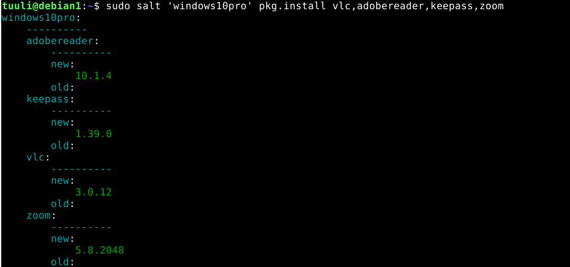

# Palvelinten hallinta - h5: Demonit

* [z) Lue ja tiivistä artikkeli muutamalla ranskalaisella viivalla.](#z)
* [a) Kerää tietoa Windowsista Saltilla.](#a)
* [b) Asenna ohjelmia Windowsille Saltilla.](#b)
* [c) Draft zero. Tee ensimmäinen versio omasta miniprojektistasi.](#c)
* [d) Tee omalle miniprojektille weppisivu.](#d)

Tämä harjoitus on osa Tero Karvisen pitämää Palvelinten hallinta ICT4TN022-3014 -kurssia Haaga-Helia ammattikorkeakoulussa syksyllä 2021.

Aloitin harjoituksen sunnuntaina 05.12.2021. Koneena oli Lenovo Yoga Slim 7 -kannettava Windows 11 Home -käyttöjärjestelmällä ja koneelle asennetun Oracle VirtualBox (6.1) -kautta Debian 11 “bullseye”.

Harjoitus perustuu Tero Karvisen antamaan ohjeistukseen, joka löytyy [kurssisivulta](https://terokarvinen.com/20 21/configuration-management-systems-palvelinten-hallinta-ict4tn022-2021-autumn/). Harjoituksen välivaiheiden tiedot perustuvat Teron Karvisen antamiin ohjeistuksiin, ellei lähdettä ole toisin merkitty.

* **Master -koneena seuraavissa harjoituksissa on VirtualBoxissa pyörivä Debian 11 (debian1)**

* **Windows -minionina harjotuksissa on VirtualBoxissa pyörivä Windows 10 pro (windows10pro)**

##z) Lue ja tiivistä artikkeli muutamalla ranskalaisella viivalla. Tässä z-alakohdassa ei tarvitse siis tehdä testejä tietokoneella. <a name="z"></a> 

Tein harjoitusta sunnuntaina 05.12.2021 klo 22:00-24:00 ja viimeistelin maanantaina 06.12.2021 klo 15:30-16:00. 

* [Karvinen 2018: Control Windows with Salt](https://terokarvinen.com/2018/control-windows-with-salt/)
* [Karvinen 2018: Configure Windows and Linux with Single Salt Module](https://terokarvinen.com/2018/configure-windows-and-linux-with-salt-jinja-if-else-and-grains/)
* [SaltStack contributors 2021: Windows Package Manager](https://docs.saltproject.io/en/latest/topics/windows/windows-package-manager.html)

---

[Karvinen 2018: Control Windows with Salt](https://terokarvinen.com/2018/control-windows-with-salt/): Tiivistelmä siitä, kuinka Salt toimii Windowsin kanssa. Uusin versio Saltista on paras Windowsille ja master:in Salt versio tulee olla sama tai uudempi, mitä minioneilla. 

**Saltin asennus Windowsille:**

* Ensin asennetaan Linuxille Salt-master (Windowsia kannattaa pyörittää pelkästään minionina, ei masterina).
* Salt asennetaan Windowsille SaltStackin sivuilta saatavalla asennustiedostolla: [https://docs.saltproject.io/en/latest/topics/installation/windows.html](https://docs.saltproject.io/en/latest/topics/installation/windows.html). 
* Windowsin Saltin asennuksen yhteydessä asennusohjelma kysyy masterin ip:tä ja minionin id:tä.
* Asennuksen jälkeen masterilla Windows-minion hyväksytään kuten muutkin minionit: `sudo salt-key -A`
* Yhtettyä voi testata komennolla `sudo salt '*' test.ping`. Windows voi vastata paljon hitaammin kuin vastaavat Linux minionit.

** Pakettien asentaminen Saltilla Windowsiin**

```
1  $ sudo mkdir /srv/salt/win
2  $ sudo chown root.salt /srv/salt/win
3  $ sudo chmod ug+rwx /srv/salt/win
```

* Rivi 1: luodaan Windowsille oma Salt -hakemisto masterille
* Rivi 2: Saltille annetaan root-oikeudet hakemistolle
* Rivi 3: omistajalle ja ryhmänjäesenille annetaan täydet oikeudet (luku, kirjoitus- ja ajo-oikeus)

Jotta paketteja pystytään tuomaan Windowsiin, täytyy olla Git asennettuna:

```
1  $ sudo salt-run winrepo.update_git_repos
2  $ sudo salt -G 'os:windows' pkg.refresh_db
```

* Rivi 1: Alustetaan Salt asentamaan Windowsille paketteja.
* Rivi 2: Ajaa repositorion kaikille Windows-minioneille.
* [SaltStack: Windows Software repository](https://docs.saltproject.io/en/3000/topics/windows/windows-package-manager.html#configuration).

```
1  $ sudo salt '*' pkg.install vlc
2  $ sudo salt '*' pkg.install gedit,firefox,steam,vlc
```

* Rivi 1: Asentaa yhden paketin
* Rivi 2: Asentaa monta pakettia

**Windowsin cmd:ssä Salt -komentojen ajaminen**

Komentoja ajetaan Windowsin Terminaalissa administratorina. Saltin komennot kuten `salt-call --local` toimivat myös Windowsissa.

Artikkelissa käytiin läpi myös:

* Pakettien asentaminen Chocolatey:lla.
* Saltilla Windows -tilan tekeminen.
* Vagrant Windows Server 2016:lla

---

[Karvinen 2018: Configure Windows and Linux with Single Salt Module](https://terokarvinen.com/2018/configure-windows-and-linux-with-salt-jinja-if-else-and-grains/): Artikkeli kertoo, miten luodaan Salt -tiloja, joita pystytään käyttämään monella erilaisella käyttöjärjestelmällä yhtäaikaisesti.

* Windowsissa polku on "C:\esimerkki" kun taas Linuxissa "/tmp/esimerkki".
* Kun kirjoitat tilan, joka on tarkoitettu eri käyttöjärjestelmille, testaa ensin yhdessä käyttöjärjestelmässä.
* Tilassa tulee olla ehdot eri käyttöjärjestelmille ja ne tulee sijoittaa tilan alkuun.

** Tila, jota halutaan käyttää sekä Linuxissa ja Windowsissa: ** 

```
1  /srv/salt/hello/init.sls
2 
3  
4  
5  
6  
7  
8  {{ hellofile }}:
9   file.managed:
10   - source: salt://hello/hellotero.txt
```
* Rivi 1: Muokattavan tilan polku
* Rivi 3-4: Jos käyttöjärjestelmä on Windows, määritellään polku Windowsin mukaisesti
* Rivi 6: Linuxin mukainen polku

Näytä luotu tila:

	$ sudo salt '*' state.show_sls hello --out yaml

---

[SaltStack contributors 2021: Windows Package Manager](https://docs.saltproject.io/en/latest/topics/windows/windows-package-manager.html): SaltStackin dokumentaatiosivu Windowsin paketinhallinta managerille (The Windows Package Manager). Kun Linuxissa paketinhallintaa suoritetaan `yum`:lla tai `apt`:lla, on tämä samanlainen, mutta Windowsille. SaltStack on luonut Git repositorion, jossa säilytetään valmiiksi luotoja .sls -tiedostoja, joiden avulla voidaan asentaa Windowsiin ohjelmia. 

Repositorion osoite: [https://github.com/saltstack/salt-winrepo-ng](https://github.com/saltstack/salt-winrepo-ng)

Repositorin tuominen ja ohjelman asentaminen Windowsille Saltilla:

```
1 salt-run winrepo.update_git_repos
2 salt * pkg.refresh_db
3 salt * pkg.install firefox_x64
```

* Rivi 1: Hakee Gitistä repositorion, joka sisältää tarvittavat .sls -tieodostot
* Rivi 2: Päivittää haetun tietokannan minioneille
* Rivi 3: Asentaa ohjelman Firefox

Repositorion oletuspolut:

* Linux master: `/srv/salt/win/repo-ng`
* Minion, jolla ei ole masteria: `C:\salt\srv\salt\win\repo-n`

Pakettien päivitys tapahtuu komennoilla:

* Masterilta: `salt -G 'os:windows' pkg.refresh_db`
* Paikallisesti (esim. minionilta): `salt-call --local pkg.refresh_db`

Pakettien poistaminen:

* Masterilta: `salt winminion pkg.remove firefox_x64`
* Paikallisesti (esim. minionilta): `salt-call --local pkg.remove firefox_x64`

Lisäksi artikkelissa käsitellään .sls -tiedostojen konfigurointia ja muita yksityiskohtia, joita  Windows Package Manageriin kuuluu.

## a) Kerää tietoa Windowsista Saltilla. Mitkä kohdat ovat erityisesti Windowsin osalta kiinnostavia? Selitä kohdat. (Asenna tarvittaessa Salt Windowsiin, jos et tehnyt sitä tunnilla). <a name="a"></a> 

Tein harjoitusta 06.12.2021 klo 14:00-14:30

Olin asentanut tunnilla Windows 10 pro:n .iso -tiedostosta VirtualBoxiin. Olin myös asentanut Saltin Windowsiin ja määrittänyt masteriksi Debian1 -virtuaalikoneen.

Keräsin tiedot komennolla: `sudo salt 'windows10pro' grains.items -l info`. 


Valitsin joitakin, joiden arvelen olevan Windowsin kannalta mielenkiintoisia:


* cpu_model: prosessorin malli.
* cpuarch: prosessorin arkkitehtuuri (64 bittinen).
* master: Salt-masterin IPv4-osoite.
* mem_total: RAM-muisti, joka on varattu koneelle.
* osfullname: Käyttöjärjestelmän koko nimi. 
* path: Windowsin polut järjestelmäasetuksiin.
* saltpath: Saltin polut Windowsissa.
* saltversion: Saltin versio (tulee olla sama tai uudempi kuin masterilla).
* shell: Windowsin komentotulkin polku. 
* systempath: Sama kuin "path" -kohta.
* windowsdomain: Toimialue, eli mihin ryhmään kone kuuluu. "Workgroup" -ryhmään kuuuluva Windows toimii itsenäisesti, eli ei kuuluu mihinkään domainiin.


## b) Asenna ohjelmia Windowsille Saltilla. <a name="b"></a>

Tein harjoitusta 06.12.2021 klo 14:30 - 15:30.

Ensin asensin masterille Windowsin hallintaan tarkoitetun oman Salt-hakemiston, johon muutin oikeudet ja hain Windowsille tarkoitetun paketin hallinnan tämän ohjeen mukaisesti: [Karvinen 2018: Control Windows with Salt](https://terokarvinen.com/2018/control-windows-with-salt/).

```
tuuli@debian1:~$ sudo mkdir /srv/salt/win
tuuli@debian1:~$ sudo chown root.salt /srv/salt/win
tuuli@debian1:~$ sudo chmod ug+rwx /srv/salt/win
tuuli@debian1:~$ sudo salt-run winrepo.update_git_repos
tuuli@debian1:~$ sudo salt -G 'os:windows' pkg.refresh_db
```


Ylläolevasta kuvasta näkee, että Salt haki Gitistä Windowsin paketinhallintaan tarvittavat repositoriot omiin polkuihinsa. Sen jälkeen se ajoi paketinhallinnan kaikille Windows-koneille, jotka minioneista löytyi (tässä tapauksessa yksi: windows10pro). Minion ubuntus1 oli tällä kertaa pois päältä ja siksi virheilmoitus. Ajo meni meni onnistuneesti läpi: `success: 311`. Eli 311 pakettia tuotiin.

Tässä vaiheessa tutkin hakemistoja, jotka tuotiin Gitista:

```
/srv/salt/win/repo-ng/salt-winrepo-ng
/srv/salt/win/repo/salt-winrepo
```


Ymmärsin, että Gitin repositoriosta tuotiin Windowsille luotuja .sls -tiedostoja, joiden avulla pystytään asentamaan ohjelmia Windowsille Saltin avulla. [SaltStack: salt.modules.win_pkg.refresh_db](https://docs.saltproject.io/en/latest/ref/modules/all/salt.modules.win_pkg.html) kertoi, että komento `pkg.refresh_db` vie tämän ensin Saltin masterille tuodun tietokannan Windowsille ja .sls -tiedostot löytyisivät oletusarvoisesti Windowsilla polusta: `C:\salt\var\cache\salt\minion\files\base\win\repo-ng\repo-ng`.

Pienen tutkimisen jälkeen kyseinen kansio löytyi polusta: `C:\ProgramData\Salt Project\Salt\var\cache\salt\minion\files\base\win\repo-ng`.


Seuraavaksi päätin asentaa pari ohjelmaa Saltilla Windowsille. Ensin päätin kokeilla asentaa masterilla Windows-minionille yhden ohjelman: Firefoxin:

	tuuli@debian1:~$ sudo salt 'windows10pro' pkg.install firefox


Ei löytänyt Firefoxin pakettia. Mietin, että paketin nimi saattoi olla jokin muu. Tarkistin, mitä eri mahdollisia .sls tiedostoja repostoriosta oli tuotu Firefoxin asentamiseen:

```
tuuli@debian1:~$ ls -la /srv/salt/win/repo-ng/salt-winrepo-ng/ |grep 'firefox'
-rw-r--r--  1 salt salt  2323  6.12. 14:27 firefox-esr_x64.sls
-rw-r--r--  1 salt salt  2604  6.12. 14:27 firefox-esr_x86.sls
-rw-r--r--  1 salt salt  2621  6.12. 14:27 firefox_x64.sls
-rw-r--r--  1 salt salt  3126  6.12. 14:27 firefox_x86.sls
```

Selvitin, että esr -versio on [Firefox Extended Support Release (ESR)](https://support.mozilla.org/en-US/kb/switch-to-firefox-extended-support-release-esr) ja se on tarkoitettu suurempien organisaatioiden käyttöön, joten päätin kokeilla asennusta firefox_x64 -versiolla, joka on tarkoitettu 64 bittisille koneille (kuten tämä Windows, johon sitä olin asentamassa).

	tuuli@debian1:~$ sudo salt 'windows10pro' pkg.install firefox_x64
 


Nyt Firefox asentui. Tarkistin vielä käsin Windowsista:


Toimi.

Seuraavaksi kokeilin asentaa muutaman samanaikaisesti ja tarkistin niiden oikeat asennusnimet:

* vlc
* adobereader
* keepass
* zoom

	tuuli@debian1:~$ sudo salt 'windows10pro' pkg.install vlc,adobereader,keepass,zoom



Pitkän latausajan jälkeen meni läpi. Tarkistus:


Toimi.

## c) Draft zero. Tee ensimmäinen versio omasta miniprojektistasi. Sen ei tarvitse olla vielä valmis, vaan se voi vaikkapa toteuttaa pienen osan tarvittavasta toiminnallisuudesta. Jonkin (pienenkin) asian pitää kuitenkin toimia niin, että projektisi säätää jotain Saltilla tai vastaavalla työkalulla.<a name="c"></a>

Aloitin projektin aiheen mietinnän siitä, miten voisin hyötyä projektista. Tähän mennessä olen käyttänyt hyvin vähän Linuxia eikä minulla ollut host käyttöjärjestelmänä Linuxia koneessani. Olen suunnitellut tyhjentäväni ja asentavani vanhaan kannettavaani Ubuntun, joten päätin lähteä tekemään itselleni mieluisia alkukonfiguraatioita Ubuntuun, jotka voisin kerralla ajaa Saltilla käyttöjärjestelmän käyttöönottaessani.

Syksyn aikana olen pystyttänyt monta virtuaalikonetta niin Debian 11, Ubuntu server 20.04.3 kuin Ubuntu desktop  20.04.3 LTS. Olen huomannut, että minulle on tullut joitakin vakiokonfiguraatioita, jotka teen joka kerta: bash completion, tree, net-tools, nanon konfigurointi omia tarpeita vastaavaksi, ssh ja ufw (palomuuri). 

Osa on minulla jo melko valmiina aikaisemmista harjoituksistani. Minulla on hyvin rajallisesti aikaa toteuttaa tämä projekti, joten joudun pitämään projektin suppeana. Ensisijaisena tarkoituksena on koostaa konfiguraatioista tilat, jotka voin ajaa kerralla ottaessani uuden Ubuntu käyttöjärjestelmällä varustetun kannettavan käyttöön (tai minkä tahansa koneen tai  virtuaalikoneen). Mahdollisesti jos ehdin, yritän laajentaa projektia

Alkusuunnitelma:

* Bash completion
* Tree
* Net-tools
* Git
* Nanon konfigurointi
* SSH:n konfiguraatiot
* Palomuuriasetukset päälle ja porttien avaukset

** Edit: ** Aloin tämän kirjoittamisen jälkeen samana iltana tekemään ensimmäistä versiota projektista ja totesin, että sain ylläolevat kohdat (lukuunottamatta palomuuria) tehtyä, sillä olen ne jo harjoituksissa tehnyt, joten jatkan eteenpäin moduulin kehittämistä ja yritän haastaa itseäni. 

Mietin mitä voisin mahdollisesti tuoda konfiguraatiooni lisää:

* Firefoxin konfiguroiminen, esim. omien kirjanmerkkien tuominen ja oletusetusivun (tai hakukoneen) muuttaminen ducduckgo:ksi.
* Eclipsen asennus
* VirtualBoxin asennus

## d) Tee omalle miniprojektille weppisivu. (Voi olla myös GitLabin/GitHubin automaattisesti README.md -tiedostosta tekemä).<a name="d"></a>

Raportti moduulin rakentamisesta löytyy täältä: [https://github.com/tuuli-huhtanen/palvelintenhallinta/blob/main/h7-omamoduuli.md](https://github.com/tuuli-huhtanen/palvelintenhallinta/blob/main/h7-omamoduuli.md)

Miniprojektin repositorio: [https://github.com/tuuli-huhtanen/palvelintenhallinta-moduuli](https://github.com/tuuli-huhtanen/palvelintenhallinta-moduuli)
