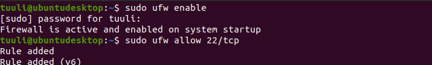
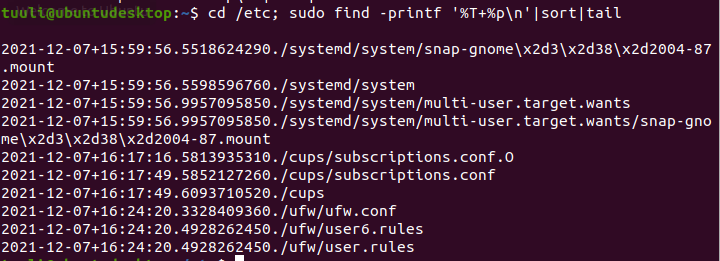
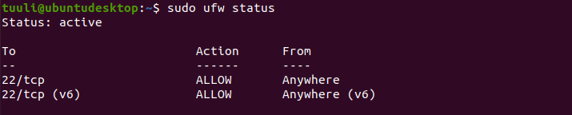
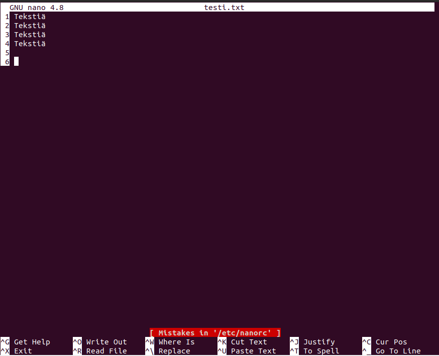
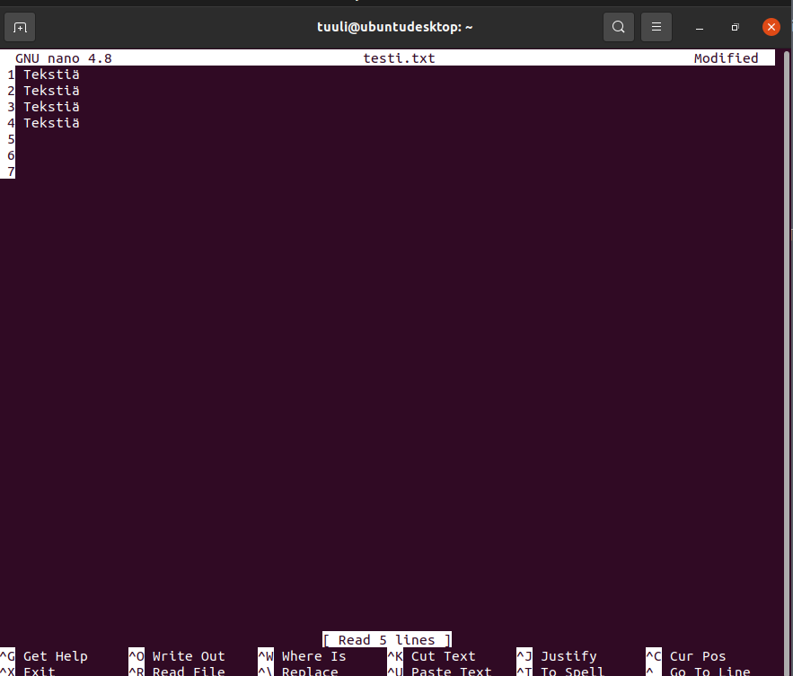
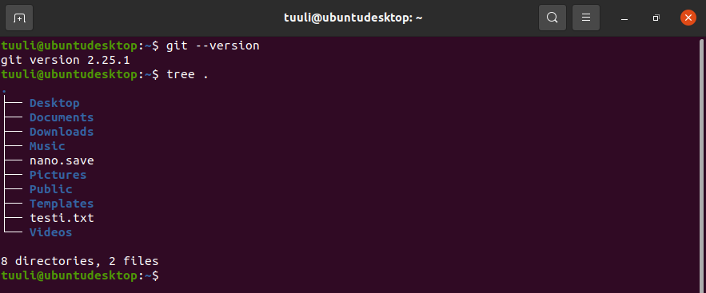
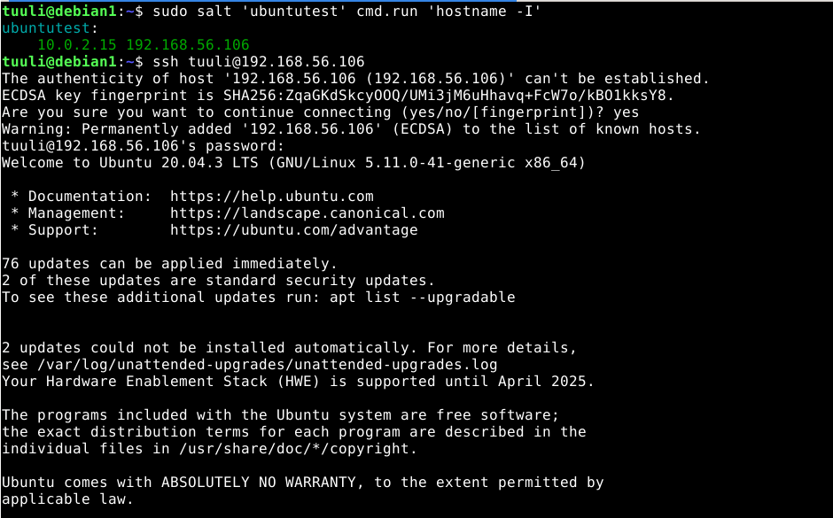

# Palvelinten hallinta - h7: Oma moduuli

Tämä harjoitus on osa Tero Karvisen pitämää Palvelinten hallinta ICT4TN022-3014 -kurssia Haaga-Helia ammattikorkeakoulussa syksyllä 2021.

Tätä raporttia on tehty monessa osassa ja otsikot menevät päivämäärän mukaan.  Koneena oli Lenovo Yoga Slim 7 -kannettava Windows 11 -käyttöjärjestelmällä ja koneelle asennetun Oracle VirtualBox (6.1) -kautta Debian 11 “bullseye”.

**Vaiheet:**
* [06.12.2021 Projektin alkusuunnitelma ja ensimmäinen 'raakaversio'](#06.12.2021)
* [07.12.2021 ufw -moduuli ja testaamista minionilla](#07.12.2021)

## 06.12.2021 Projektin alkusuunnitelma ja ensimmäinen 'raakaversio' <a href="06.12.2021"></a>

Aloitin harjoituksen noin klo 19 aikoihin.

Rakennan moduulin omaan käyttöön. Tarkoitus on luoda moduuli, jolla asennan itselleni tavallisimpia ohjelmia ja konfiguraatioita Ubuntu Desktop 20.04.3 -käyttöjärjestelmään. Olen tekemässävanhasta Windows-kannettavastani Linux-konetta jossain vaiheessa ja haluaisin luoda itselleni moduuli, jota voin käyttää kannettavani alkukongifuraatioiden määrittelemisessä ja mahdollisesti myös myöhemmin muissa koneissa (vaatinee myös moduulin kehittämistä kurssin jälkeen).

Alkusuunnitelma: *(saattaa muuttua projektin edetessä)*

* Bash completion
* Tree
* Net-tools
* Git
* Nanon konfigurointi
* SSH:n konfiguraatiot
* Palomuuriasetukset päälle ja porttien avaukset

### pkgs -moduuli<a href="06.12.2021pkgs"></a>
Aloitin luomalla tilan niille ohjelmille, jotka aion pelkästään asentaa ilman konfiguraatioita:

* Bash completion
* Tree
* Net-tools
* Git


Ensin loin "pkgs" moduulin ja init.sls:

``` 
$ sudo mkdir /srv/salt/pkgs
$ sudoedit /srv/salt/pkgs/init.sls
```

Tämän jälkeen kirjoitin ohjelmien asennuksen:

```
1 default_pkgs:
2   pkg.installed:
3     - pkgs:
4       - bash-completion
5       - tree
6       - net-tools
7       - git
```

Sen jälkeen testasin ajamalla paikallisesti masterilla:

```
$ sudo salt-call --local state.apply pkgs
```

Ajo onnistui - ohjelmat oli jo asennettuna:

```
local:
----------
          ID: default_pkgs
    Function: pkg.installed
      Result: True
     Comment: All specified packages are already installed
     Started: 19:52:27.468533
    Duration: 52.616 ms
     Changes:   

Summary for local
------------
Succeeded: 1
Failed:    0
------------
Total states run:     1
Total run time:  52.616 ms
```

### nano -moduuli<a href="06.12.2021nano"></a>

Sen jälkeen loin konfiguraation Nanolle. Koska olen tekemässä itselleni tarpeellista konfiguraatiota, minulta löytyi jo valmiiksi masterilta omiin tarpeisiini sopiva Nanon konfiguraatiotiedosto. Päätin kopioida sen masterilta Saltin juureen samalla siivoen ylimääräiset pois, kuten tein [harjoituksessa 5 kohdassa a)](https://github.com/tuuli-huhtanen/palvelintenhallinta/blob/main/h5-demonit.md#a).

Omiin konfiguraatioihin kuuluu default-asetuksista poiketen: 

* `set linenumbers` = rivinumerot näkyviin
* `set softwrap` = wrappaa tekstin ikkunassa


Ensin loin "nano" moduulin ja init.sls:

```
$ sudo mkdir /srv/salt/nano
$ sudoedit mkdir /srv/salt/nano/init.sls
```

Loin init.sls tiedostoon ohjelmoinnin, joka vie Nanon konfiguraatiotiedoston nanorc sen oikeaan polkuun /etc -hakemistoon ja hakee halutun tiedoston Saltin juuresta:

```
 1 /etc/nanorc:
 2   file.managed:
 3     - source: salt://nano/nanorc
```

Hain toimivan nanorc -tiedoston masterilta ja siivosiin siitä samalla ylimääräiset pois:

```
$ cat /etc/nanorc |grep -v ^#|grep -v ^$| sudo tee /srv/salt/nano/nanorc
```

Tiedosto sisälsi seuraavat asetukset:

```
$ cat /srv/salt/nano/nanorc 
set linenumbers 
set softwrap
set historylog
set locking
set stateflags
set suspendable
include "/usr/share/nano/*.nanorc"
```

Ajoin testinä paikallisesti masterilla:

```
$ sudo salt-call --local state.apply nano
```

Ajo onnistui, muutoksia tuli, koska olin siivonnut tiedostoa:

```
local:
----------
          ID: /etc/nanorc
    Function: file.managed
      Result: True
     Comment: File /etc/nanorc updated
     Started: 20:28:11.947910
    Duration: 31.525 ms
     Changes:   
              ----------
              diff:
                  --- 
                  +++ 
                  @@ -1,298 +1,7 @@
                   set linenumbers
                   set softwrap
                  -
                  -## Sample initialization file for GNU nano.
                  -##
                  -## For the options that take parameters, the default value is shown.
                  -## Other options are unset by default.  To make sure that an option
                  -## is disabled, you can use "unset <option>".
                  -##
                  -## Characters that are special in a shell should not be escaped here.
                  -## Inside string parameters, quotes should not be escaped -- the last
                  -## double quote on the line will be seen as the closing quote.
                  -
                  -## Make 'nextword' (Ctrl+Right) and 'chopwordright' (Ctrl+Delete)
                  -## stop at word ends instead of at beginnings.
                  -# set afterends
                  -
                  -## When soft line wrapping is enabled, make it wrap lines at blanks
                  -## (tabs and spaces) instead of always at the edge of the screen.
                  -# set atblanks
                  -
                  -## Automatically indent a newly created line to the same number of
                  -## tabs and/or spaces as the preceding line -- or as the next line
                  -## if the preceding line is the beginning of a paragraph.
                  -# set autoindent
                  -
                  -## Back up files to the current filename plus a tilde.
                  -# set backup
                  -
                  -## The directory to put unique backup files in.
                  -# set backupdir ""
                  -
                  -## Use bold text instead of reverse video text.
                  -# set boldtext
                  -
                  -## Treat any line with leading whitespace as the beginning of a paragraph.
                  -#set bookstyle
                  -
                  -## The characters treated as closing brackets when justifying paragraphs.
                  -## This may not include any blank characters.  Only closing punctuation,
                  -## optionally followed by these closing brackets, can end sentences.
                  -# set brackets ""')>]}"
                  -
                  -## Automatically hard-wrap the current line when it becomes overlong.
                  -# set breaklonglines
                  -
                  -## Do case-sensitive searches by default.
                  -# set casesensitive
                  -
                  -## Constantly display the cursor position in the status bar.  Note that
                  -## this overrides "quickblank".
                  -# set constantshow
                  -
                  -## Use cut-from-cursor-to-end-of-line by default.
                  -# set cutfromcursor
                  -
                  -## Do not use the line below the title bar, leaving it entirely blank.
                  -# set emptyline
                  -
                  -## Set the target width for automatic hard-wrapping and for justifying
                  -## paragraphs.  If the specified value is 0 or less, the wrapping point
                  -## will be the terminal's width minus this number.
                  -# set fill -8
                  -
                  -## Remember the used search/replace strings for the next session.
                   set historylog
                  -
                  -## Display a "scrollbar" on the righthand side of the edit window.
                  -# set indicator
                  -
                  -## Scroll the buffer contents per half-screen instead of per line.
                  -# set jumpyscrolling
                  -
                  -## Display line numbers to the left (and any anchors in the margin).
                  -# set linenumbers
                  -
                  -## Enable vim-style lock-files.  This is just to let a vim user know you
                  -## are editing a file [s]he is trying to edit and vice versa.  There are
                  -## no plans to implement vim-style undo state in these files.
                   set locking
                  -
                  -## Fall back to slow libmagic to try and determine an applicable syntax.
                  -# set magic
                  -
                  -## The opening and closing brackets that can be found by bracket
                  -## searches.  They cannot contain blank characters.  The former set must
                  -## come before the latter set, and both must be in the same order.
                  -# set matchbrackets "(<[{)>]}"
                  -
                  -## Enable mouse support, if available for your system.  When enabled,
                  -## mouse clicks can be used to place the cursor, set the mark (with a
                  -## double click), and execute shortcuts.  The mouse will work in the X
                  -## Window System, and on the console when gpm is running.
                  -# set mouse
                  -
                  -## Switch on multiple file buffers (inserting a file will put it into
                  -## a separate buffer).
                  -# set multibuffer
                  -
                  -## Don't convert files from DOS/Mac format.
                  -# set noconvert
                  -
                  -## Don't display the helpful shortcut lists at the bottom of the screen.
                  -# set nohelp
                  -
                  -## Don't automatically add a newline when a file does not end with one.
                  -# set nonewlines
                  -
                  -## Set operating directory.  nano will not read or write files outside
                  -## this directory and its subdirectories.  Also, the current directory
                  -## is changed to here, so any files are inserted from this dir.  A blank
                  -## string means the operating-directory feature is turned off.
                  -# set operatingdir ""
                  -
                  -## Remember the cursor position in each file for the next editing session.
                  -# set positionlog
                  -
                  -## Preserve the XON and XOFF keys (^Q and ^S).
                  -# set preserve
                  -
                  -## The characters treated as closing punctuation when justifying
                  -## paragraphs.  They cannot contain blank characters.  Only closing
                  -## punctuation, optionally followed by closing brackets, can end
                  -## sentences.
                  -# set punct "!.?"
                  -
                  -## Do quick status-bar blanking.  Status-bar messages will disappear after
                  -## 1 keystroke instead of 26.  Note that "constantshow" overrides this.
                  -# set quickblank
                  -
                  -## The regular expression that matches quoting characters in email
                  -## or line-comment introducers in source code.  The default is:
                  -# set quotestr "^([ 	]*([!#%:;>|}]|//))+"
                  -
                  -## Try to work around a mismatching terminfo terminal description.
                  -# set rawsequences
                  -
                  -## Fix Backspace/Delete confusion problem.
                  -# set rebinddelete
                  -
                  -## Do regular-expression searches by default.
                  -## Regular expressions are of the extended type (ERE).
                  -# set regexp
                  -
                  -## Save a changed buffer automatically on exit; don't prompt.
                  -# set saveonexit
                  -## (The old form of this option, 'set tempfile', is deprecated.)
                  -
                  -## Put the cursor on the highlighted item in the file browser, and show
                  -## the cursor in the help viewer; useful for people who use a braille
                  -## display and people with poor vision.
                  -# set showcursor
                  -
                  -## Make the Home key smarter.  When Home is pressed anywhere but at the
                  -## very beginning of non-whitespace characters on a line, the cursor
                  -## will jump to that beginning (either forwards or backwards).  If the
                  -## cursor is already at that position, it will jump to the true
                  -## beginning of the line.
                  -# set smarthome
                  -
                  -## Spread overlong lines over multiple screen lines.
                  -# set softwrap
                  -
                  -## Use this spelling checker instead of the internal one.  This option
                  -## does not have a default value.
                  -# set speller "aspell -x -c"
                  -
                  -## Use the end of the title bar for some state flags: I = auto-indenting,
                  -## M = mark, L = hard-wrapping long lines, R = recording, S = soft-wrapping.
                   set stateflags
                  -
                  -## Allow nano to be suspended (with ^Z by default).
                   set suspendable
                  -## (The old form of this option, 'set suspend', is deprecated.)
                  -
                  -## Use this tab size instead of the default; it must be greater than 0.
                  -# set tabsize 8
                  -
                  -## Convert typed tabs to spaces.
                  -# set tabstospaces
                  -
                  -## Snip whitespace at the end of lines when justifying or hard-wrapping.
                  -# set trimblanks
                  -
                  -## The two single-column characters used to display the first characters
                  -## of tabs and spaces.  187 in ISO 8859-1 (0000BB in Unicode) and 183 in
                  -## ISO-8859-1 (0000B7 in Unicode) seem to be good values for these.
                  -## The default when in a UTF-8 locale:
                  -# set whitespace "»·"
                  -## The default otherwise:
                  -# set whitespace ">."
                  -
                  -## Detect word boundaries differently by treating punctuation
                  -## characters as parts of words.
                  -# set wordbounds
                  -
                  -## The characters (besides alphanumeric ones) that should be considered
                  -## as parts of words.  This option does not have a default value.  When
                  -## set, it overrides option 'set wordbounds'.
                  -# set wordchars "<_>."
                  -
                  -## Let an unmodified Backspace or Delete erase the marked region (instead
                  -## of a single character, and without affecting the cutbuffer).
                  -# set zap
                  -
                  -## Paint the interface elements of nano.  These are examples;
                  -## by default there are no colors, except for errorcolor.
                  -# set titlecolor bold,lightwhite,blue
                  -# set statuscolor bold,lightwhite,green
                  -# set errorcolor bold,lightwhite,red
                  -# set selectedcolor lightwhite,magenta
                  -# set stripecolor ,yellow
                  -# set scrollercolor cyan
                  -# set numbercolor cyan
                  -# set keycolor cyan
                  -# set functioncolor green
                  -
                  -## In root's .nanorc you might want to use:
                  -# set titlecolor bold,lightwhite,magenta
                  -# set statuscolor bold,lightwhite,magenta
                  -# set errorcolor bold,lightwhite,red
                  -# set selectedcolor lightwhite,cyan
                  -# set stripecolor ,yellow
                  -# set scrollercolor magenta
                  -# set numbercolor magenta
                  -# set keycolor lightmagenta
                  -# set functioncolor magenta
                  -
                  -
                  -## === Syntax coloring ===
                  -## For all details, see 'man nanorc', section SYNTAX HIGHLIGHTING.
                  -
                  -## To include most of the existing syntax definitions, you can do:
                   include "/usr/share/nano/*.nanorc"
                  -
                  -## Or you can select just the ones you need.  For example:
                  -# include "/usr/share/nano/html.nanorc"
                  -# include "/usr/share/nano/python.nanorc"
                  -# include "/usr/share/nano/sh.nanorc"
                  -
                  -## In /usr/share/nano/extra/ you can find some syntaxes that are
                  -## specific for certain distros or for some less common languages.
                  -
                  -
                  -## If <Tab> should always produce four spaces when editing a Python file,
                  -## independent of the settings of 'tabsize' and 'tabstospaces':
                  -# extendsyntax python tabgives "    "
                  -
                  -## If <Tab> should always produce an actual TAB when editing a Makefile:
                  -# extendsyntax makefile tabgives "	"
                  -
                  -
                  -## === Key bindings ===
                  -## For all details, see 'man nanorc', section REBINDING KEYS.
                  -
                  -## The <Ctrl+Delete> keystroke deletes the word to the right of the cursor.
                  -## On some terminals the <Ctrl+Backspace> keystroke produces ^H, which is
                  -## the ASCII character for backspace, so it is bound by default to the
                  -## backspace function.  The <Backspace> key itself produces a different
                  -## keycode, which is hard-bound to the backspace function.  So, if you
                  -## normally use <Backspace> for backspacing and not ^H, you can make
                  -## <Ctrl+Backspace> delete the word to the left of the cursor with:
                  -# bind ^H chopwordleft main
                  -
                  -## If you would like nano to have keybindings that are more "usual",
                  -## such as ^O for Open, ^F for Find, ^H for Help, and ^Q for Quit,
                  -## then uncomment these:
                  -#bind ^Q exit all
                  -#bind ^S savefile main
                  -#bind ^W writeout main
                  -#bind ^O insert main
                  -#bind ^H help all
                  -#bind ^H exit help
                  -#bind ^F whereis all
                  -#bind ^G findnext all
                  -#bind ^B wherewas all
                  -#bind ^D findprevious all
                  -#bind ^R replace main
                  -#bind M-X flipnewbuffer all
                  -#bind ^X cut all
                  -#bind ^C copy main
                  -#bind ^V paste all
                  -#bind ^P location main
                  -#bind ^A mark main
                  -#unbind ^K main
                  -#unbind ^U all
                  -#unbind ^N main
                  -#unbind ^Y all
                  -#unbind M-J main
                  -#unbind M-T main
                  -#bind ^T gotoline main
                  -#bind ^T gotodir browser
                  -#bind ^Y speller main
                  -#bind M-U undo main
                  -#bind M-R redo main
                  -#bind ^U undo main
                  -#bind ^E redo main
                  -#set multibuffer

Summary for local
------------
Succeeded: 1 (changed=1)
Failed:    0
------------
Total states run:     1
Total run time:  31.525 ms
```

### sshd -moduuli<a href="06.12.2021sshd"></a>

Seuraavaksi tein ssh-demonin ja sille tilan konfiguraatioineen. Olen tehnyt aikaisemmin [harjoituksessa 5 kohdassa a)](https://github.com/tuuli-huhtanen/palvelintenhallinta/blob/main/h5-demonit.md#a). Kopioin sshd-konfiguraatio tiedoston Saltin juureen ja määritän portiksi oletusportin 22.

Lopetin tähän noin klo 21. Jatkoin klo 22.

Minulla oli jo aikaisemmin luotu hakemisto `/srv/salt/ssh` -hakemisto, jossa oli luotuna init.sls -tiedosto ja oletusasetuksineen oleva `sshd_config`-tiedosto, joka on haettu `/etc/ssh`-hakemistosta. Asetin portin 22 asetustiedostoon ja siivosin sen ylimääräisestä:

init.sls -tiedoston sisältö oli seuraava:

```
$ cat /srv/salt/ssh/init.sls 
openssh-server:
  pkg.installed

/etc/ssh/sshd_config:
  file.managed:
    - source: salt://ssh/sshd_config

sshd:
  service.running:
    - enable: True
    - watch:
      - file: /etc/ssh/sshd_config
```

Siivosin sshd_config -tiedoston ylimääräisestä:

```
$ cd /srv/salt/ssh; cat sshd_config |grep -v ^#|grep -v ^$| sudo tee sshd_configtmp sshd_configtmp sshd_config
```

Tarkistin:

```
/srv/salt/ssh$ cat sshd_config
Include /etc/ssh/sshd_config.d/*.conf
Port 22
ChallengeResponseAuthentication no
UsePAM yes
X11Forwarding yes
PrintMotd no
AcceptEnv LANG LC_*
Subsystem	sftp	/usr/lib/openssh/sftp-server
```

Poistin ylimääräisen sshd_configtmp -tiedoston:

```
$ sudo rm /srv/salt/ssh/sshd_configtmp 
```

Tarkistin tiedostorakenteen vielä:

```
$ tree /srv/salt/ssh
/srv/salt/ssh
├── init.sls
└── sshd_config
```

Ajoin paikallisesti testiksi ja testi meni läpi muutoksineen:

```
$ sudo salt-call --local state.apply ssh
local:
----------
          ID: openssh-server
    Function: pkg.installed
      Result: True
     Comment: All specified packages are already installed
     Started: 22:43:23.899389
    Duration: 48.723 ms
     Changes:   
----------
          ID: /etc/ssh/sshd_config
    Function: file.managed
      Result: True
     Comment: File /etc/ssh/sshd_config updated
     Started: 22:43:23.950050
    Duration: 20.774 ms
     Changes:   
              ----------
              diff:
                  --- 
                  +++ 
                  @@ -1,123 +1,8 @@
                  -#	$OpenBSD: sshd_config,v 1.103 2018/04/09 20:41:22 tj Exp $
                  -
                  -# This is the sshd server system-wide configuration file.  See
                  -# sshd_config(5) for more information.
                  -
                  -# This sshd was compiled with PATH=/usr/bin:/bin:/usr/sbin:/sbin
                  -
                  -# The strategy used for options in the default sshd_config shipped with
                  -# OpenSSH is to specify options with their default value where
                  -# possible, but leave them commented.  Uncommented options override the
                  -# default value.
                  -
                   Include /etc/ssh/sshd_config.d/*.conf
                  -
                   Port 22
                  -#AddressFamily any
                  -#ListenAddress 0.0.0.0
                  -#ListenAddress ::
                  -
                  -#HostKey /etc/ssh/ssh_host_rsa_key
                  -#HostKey /etc/ssh/ssh_host_ecdsa_key
                  -#HostKey /etc/ssh/ssh_host_ed25519_key
                  -
                  -# Ciphers and keying
                  -#RekeyLimit default none
                  -
                  -# Logging
                  -#SyslogFacility AUTH
                  -#LogLevel INFO
                  -
                  -# Authentication:
                  -
                  -#LoginGraceTime 2m
                  -#PermitRootLogin prohibit-password
                  -#StrictModes yes
                  -#MaxAuthTries 6
                  -#MaxSessions 10
                  -
                  -#PubkeyAuthentication yes
                  -
                  -# Expect .ssh/authorized_keys2 to be disregarded by default in future.
                  -#AuthorizedKeysFile	.ssh/authorized_keys .ssh/authorized_keys2
                  -
                  -#AuthorizedPrincipalsFile none
                  -
                  -#AuthorizedKeysCommand none
                  -#AuthorizedKeysCommandUser nobody
                  -
                  -# For this to work you will also need host keys in /etc/ssh/ssh_known_hosts
                  -#HostbasedAuthentication no
                  -# Change to yes if you don't trust ~/.ssh/known_hosts for
                  -# HostbasedAuthentication
                  -#IgnoreUserKnownHosts no
                  -# Don't read the user's ~/.rhosts and ~/.shosts files
                  -#IgnoreRhosts yes
                  -
                  -# To disable tunneled clear text passwords, change to no here!
                  -#PasswordAuthentication yes
                  -#PermitEmptyPasswords no
                  -
                  -# Change to yes to enable challenge-response passwords (beware issues with
                  -# some PAM modules and threads)
                   ChallengeResponseAuthentication no
                  -
                  -# Kerberos options
                  -#KerberosAuthentication no
                  -#KerberosOrLocalPasswd yes
                  -#KerberosTicketCleanup yes
                  -#KerberosGetAFSToken no
                  -
                  -# GSSAPI options
                  -#GSSAPIAuthentication no
                  -#GSSAPICleanupCredentials yes
                  -#GSSAPIStrictAcceptorCheck yes
                  -#GSSAPIKeyExchange no
                  -
                  -# Set this to 'yes' to enable PAM authentication, account processing,
                  -# and session processing. If this is enabled, PAM authentication will
                  -# be allowed through the ChallengeResponseAuthentication and
                  -# PasswordAuthentication.  Depending on your PAM configuration,
                  -# PAM authentication via ChallengeResponseAuthentication may bypass
                  -# the setting of "PermitRootLogin without-password".
                  -# If you just want the PAM account and session checks to run without
                  -# PAM authentication, then enable this but set PasswordAuthentication
                  -# and ChallengeResponseAuthentication to 'no'.
                   UsePAM yes
                  -
                  -#AllowAgentForwarding yes
                  -#AllowTcpForwarding yes
                  -#GatewayPorts no
                   X11Forwarding yes
                  -#X11DisplayOffset 10
                  -#X11UseLocalhost yes
                  -#PermitTTY yes
                   PrintMotd no
                  -#PrintLastLog yes
                  -#TCPKeepAlive yes
                  -#PermitUserEnvironment no
                  -#Compression delayed
                  -#ClientAliveInterval 0
                  -#ClientAliveCountMax 3
                  -#UseDNS no
                  -#PidFile /var/run/sshd.pid
                  -#MaxStartups 10:30:100
                  -#PermitTunnel no
                  -#ChrootDirectory none
                  -#VersionAddendum none
                  -
                  -# no default banner path
                  -#Banner /etc/ssh/sshd-banner
                  -
                  -# Allow client to pass locale environment variables
                   AcceptEnv LANG LC_*
                  -
                  -# override default of no subsystems
                   Subsystem	sftp	/usr/lib/openssh/sftp-server
                  -
                  -# Example of overriding settings on a per-user basis
                  -#Match User anoncvs
                  -#	X11Forwarding no
                  -#	AllowTcpForwarding no
                  -#	PermitTTY no
                  -#	ForceCommand cvs server
----------
          ID: sshd
    Function: service.running
      Result: True
     Comment: Service restarted
     Started: 22:43:23.991151
    Duration: 48.467 ms
     Changes:   
              ----------
              sshd:
                  True

Summary for local
------------
Succeeded: 3 (changed=2)
Failed:    0
------------
Total states run:     3
Total run time: 117.964 ms

```

Lopetin harjoituksen noin klo 23:00

## 07.12.2021 ufw -moduuli ja testaamista minionilla<a href="07.12.2021"></a>

### ufw -moduuli<a href="07.12.2021ufw"></a>

Aloitin harjoituksen noin klo 16:00.

Olin [harjoituksessa 5 kohdassa a)](https://github.com/tuuli-huhtanen/palvelintenhallinta/blob/main/h5-demonit.md#a) jo aloittanut palomuuritilan tekemisen, mutten ollut onnistunut, joten yritän saada sen nyt onnistumaan.

Minulla ei ollut luotuna ufw -moduulia, joten aloitin rakentamaan sitä aivan alusta. Moduulin tarkoitus on asentaa palomuuri, pitää se aktivoituna ja puhkaista siihen reikä ssh:ta varten. Minulla oli jonkinlainen käsitys siitä, miten moduuli rakennettaisiin ja olin edellisen harjoitukseni jälkeen tutkinut lisää aihetta. 

Aloitin kuitenkin tyhjältä pöydältä. Minulla oli testaukseen virtuaalikone Ubuntu Desktop 20.04.3, joka oli suoraan VirtualBoxin kautta auki. Ubuntussa tulee ufw valmiiksi asennettuna, mutta ei aktivoituna: [Ubuntu documentation: UFW](https://help.ubuntu.com/community/UFW). Päätin aktivoida ufw:n ja avata portin 22/tcp:

```
$ sudo ufw enable 
$ sudo ufw allow 22/tcp
```



Tämän jälkeen päätin tarkistaa mitä tiedostoja muutokset olivat muuttaneet:

```
cd /etc; sudo find -printf '%T+ %p\n'|sort|tail
```



Eli seuraavat tiedostot:

```
/etc/ufw/ufw.conf
/etc/ufw/user6.rules
/etc/ufw/user.rules
```

Tarkistin vielä ufw-asetukset komennolla `sudo ufw status`:



Palomuuri aktivoitu ja haluttu portti 22/tcp auki.


Ubuntu desktop -virtuaalikoneella oli ssh asennettu ja aktivoitu ja nyt palomuuri päällä, jossa on reikä tehty ssh:lle. Päätin ottaa master-koneelta yhteyden Ubuntu desktop -virtuaalikoneeseen, koska en halusin tuoda sieltä konfiguraatioasetukset masterille Saltiin, resetoida Ubuntun ufw-asetukset ja testata luodun moduulin ajamista Ubuntuun.

Tarkistin ensin Ubuntulla sen IP-osoitteen ja otin masterilta (debian1) ssh-yhteyden Ubuntuun:

```
ssh tuuli@192.168.56.105
```

Yhteyden luonti onnistui. Kopioin tiedostot ssh-yhteyden avulla (olisin voinut käyttää itse asiassa myös sftp:tä - tajusin kopioimisen jälkeen). Eli loin masterille vastaavat tiedostot `/srv/salt/ufw` -hakemistoon:

``` 
tuuli@ubuntudesktop:~$ cat /etc/ufw/ufw.conf 
# /etc/ufw/ufw.conf
#

# Set to yes to start on boot. If setting this remotely, be sure to add a rule
# to allow your remote connection before starting ufw. Eg: 'ufw allow 22/tcp'
ENABLED=yes

# Please use the 'ufw' command to set the loglevel. Eg: 'ufw logging medium'.
# See 'man ufw' for details.
LOGLEVEL=low

tuuli@ubuntudesktop:~$ sudo cat /etc/ufw/user6.rules  
*filter
:ufw6-user-input - [0:0]
:ufw6-user-output - [0:0]
:ufw6-user-forward - [0:0]
:ufw6-before-logging-input - [0:0]
:ufw6-before-logging-output - [0:0]
:ufw6-before-logging-forward - [0:0]
:ufw6-user-logging-input - [0:0]
:ufw6-user-logging-output - [0:0]
:ufw6-user-logging-forward - [0:0]
:ufw6-after-logging-input - [0:0]
:ufw6-after-logging-output - [0:0]
:ufw6-after-logging-forward - [0:0]
:ufw6-logging-deny - [0:0]
:ufw6-logging-allow - [0:0]
:ufw6-user-limit - [0:0]
:ufw6-user-limit-accept - [0:0]
### RULES ###

### tuple ### allow tcp 22 ::/0 any ::/0 in
-A ufw6-user-input -p tcp --dport 22 -j ACCEPT

### END RULES ###

### LOGGING ###
-A ufw6-after-logging-input -j LOG --log-prefix "[UFW BLOCK] " -m limit --limit 3/min --limit-burst 10
-A ufw6-after-logging-forward -j LOG --log-prefix "[UFW BLOCK] " -m limit --limit 3/min --limit-burst 10
-I ufw6-logging-deny -m conntrack --ctstate INVALID -j RETURN -m limit --limit 3/min --limit-burst 10
-A ufw6-logging-deny -j LOG --log-prefix "[UFW BLOCK] " -m limit --limit 3/min --limit-burst 10
-A ufw6-logging-allow -j LOG --log-prefix "[UFW ALLOW] " -m limit --limit 3/min --limit-burst 10
### END LOGGING ###

### RATE LIMITING ###
-A ufw6-user-limit -m limit --limit 3/minute -j LOG --log-prefix "[UFW LIMIT BLOCK] "
-A ufw6-user-limit -j REJECT
-A ufw6-user-limit-accept -j ACCEPT
### END RATE LIMITING ###
COMMIT

tuuli@ubuntudesktop:~$ sudo cat /etc/ufw/user.rules 
*filter
:ufw-user-input - [0:0]
:ufw-user-output - [0:0]
:ufw-user-forward - [0:0]
:ufw-before-logging-input - [0:0]
:ufw-before-logging-output - [0:0]
:ufw-before-logging-forward - [0:0]
:ufw-user-logging-input - [0:0]
:ufw-user-logging-output - [0:0]
:ufw-user-logging-forward - [0:0]
:ufw-after-logging-input - [0:0]
:ufw-after-logging-output - [0:0]
:ufw-after-logging-forward - [0:0]
:ufw-logging-deny - [0:0]
:ufw-logging-allow - [0:0]
:ufw-user-limit - [0:0]
:ufw-user-limit-accept - [0:0]
### RULES ###

### tuple ### allow tcp 22 0.0.0.0/0 any 0.0.0.0/0 in
-A ufw-user-input -p tcp --dport 22 -j ACCEPT

### END RULES ###

### LOGGING ###
-A ufw-after-logging-input -j LOG --log-prefix "[UFW BLOCK] " -m limit --limit 3/min --limit-burst 10
-A ufw-after-logging-forward -j LOG --log-prefix "[UFW BLOCK] " -m limit --limit 3/min --limit-burst 10
-I ufw-logging-deny -m conntrack --ctstate INVALID -j RETURN -m limit --limit 3/min --limit-burst 10
-A ufw-logging-deny -j LOG --log-prefix "[UFW BLOCK] " -m limit --limit 3/min --limit-burst 10
-A ufw-logging-allow -j LOG --log-prefix "[UFW ALLOW] " -m limit --limit 3/min --limit-burst 10
### END LOGGING ###

### RATE LIMITING ###
-A ufw-user-limit -m limit --limit 3/minute -j LOG --log-prefix "[UFW LIMIT BLOCK] "
-A ufw-user-limit -j REJECT
-A ufw-user-limit-accept -j ACCEPT
### END RATE LIMITING ###
COMMIT
```

Masterilla (debian1) hakemisto näytti seuraavalta:

```
tuuli@debian1:~$ tree /srv/salt/ufw
/srv/salt/ufw
├── ufw.conf
├── user6.rules
└── user.rules

0 directories, 3 files
```

Konfiguraatiotiedostot oli tuotu Ubuntu Desktopista halutuilla muutoksilla ja seuraavaksi aloin tekemään init.sls -tiedostoa. Aiheesta on tehty edellisillä kursseilla moduuleita, joten löysin paljon tietoa siitä, miten ufw -moduuli kannattaa rakentaa.

Aloitin luomalla tiedoston:

```
$ sudoedit /srv/salt/ufw/init.sls
```

Ensin määräsin asentamaan ufw:n, jos sitä ei ole asennettuna:

```
 1 ufw:
 2   pkg.installed
```

Tämän jälkeen tuon Saltin juureen kopioimani tarpeelliset konfiguraatiotiedostot:

```
 4 /etc/ufw/ufw.conf:
 5   file.managed:
 6     - source: salt://ufw/ufw.conf
 7     
 8 /etc/ufw/user.rules:
 9   file.managed:
10     - source: salt://ufw/user.rules
11
12 /etc/ufw/user6.rules:
13   file.managed:
14     - source: salt://ufw/user6.rules
```

[Harjoituksessa, joka jäi minulta kesken (h5/a)](https://github.com/tuuli-huhtanen/palvelintenhallinta/blob/main/h5-demonit.md#a), jäin pohtimaan, miten ufw:n saa aktivoitua Saltilla. Löysin [Sami Kulonpään tekemän moduulin aiemmalle kurssikerralle](https://github.com/samikul/PalvelintenHallinta-ICT4TN022-3011/wiki/h7-Oma-moduli), jossa hän toteuttaa ratkaisun cmd.run:ina. Hän on myös maininnut, miten cdm.run:in saa idempotentiksi, sillä se ei sitä ole. `cmd.run` vaatii ehdon `- unless: `, jonka avulla saavutetaan idempotenssi. Tutkin aihetta ja löysin [SaltStack: Glossary](https://docs.saltproject.io/en/latest/glossary.html) -sivulta kohdasta "Idempotent" maininnan, että `cdm.run` ei ole idempotentti ja koska tilan tulisi olla idempotentti, se saavutetaan käyttämällä vaatimusta `unless` tai `onlyif`. 

Päädyin seuraavanlaiseen ratkaisuun: (Sovellettu lähteestä: Sami Kulonpää /  [https://github.com/samikul/ph-moduuli/blob/main/ufw/init.sls](https://github.com/samikul/ph-moduuli/blob/main/ufw/init.sls).
```
16 'ufw enable':
17   cmd.run:
18     - unless: 'ufw enable | grep active'
```

* Rivi 16: komentotulkki komento, jolla aktivoidaan palomuuri
* Rivi 17: kerrotaan, että ajetaan komentotulkissa komento (rivillä 16 oleva)
* Rivi 18: tehdään tilasta idempotentti, eli jos hipsuissa oleva komento toteutuu (eli ufw on jo aktivoitu), ei komentoa `ufw enable` ajeta

Moduulin rakenne ja init.sls -tiedostot näyttivät seuraavalta:

```
tuuli@debian1:~$ tree /srv/salt/ufw
/srv/salt/ufw
├── init.sls
├── ufw.conf
├── user6.rules
└── user.rules

0 directories, 4 files
tuuli@debian1:~$ cat /srv/salt/ufw/init.sls 
ufw:
  pkg.installed

/etc/ufw/ufw.conf:
  file.managed:
    - source: salt://ufw/ufw.conf

/etc/ufw/user.rules:
  file.managed:
    - source: salt://ufw/user.rules

/etc/ufw/user6.rules:
  file.managed:
    - source: salt://ufw/user6.rules

'ufw enable':
  cmd.run:
    - unless: 'ufw enable | grep active'
```

En halunnut ajaa tilaa masterilla, koska siinä oli omat ufw-asetuksensa, joita en halunnut sotkea. Päätin ajaa ensimmäisen testin uudelle Ubuntu Desktopille, joka oli oletusasetuksissa (ei siis edellinen, johon säädin ufw-asetuksia ja toin konfiguraatiotiedostot.


Asensin ensin tyhjään Ubuntu desktopiin salt-minionin SaltStackistä löytyvien avainten avulla: [https://repo.saltproject.io/#ubuntu](https://repo.saltproject.io/#ubuntu).

```
# Asensin curl:in, jotta voin tuoda avaimet:
ubuntudesktop$ sudo apt-get install curl

# Avainten tuonti:
ubuntudesktop:~$ sudo curl -fsSL -o /usr/share/keyrings/salt-archive-keyring.gpg https://repo.saltproject.io/py3/ubuntu/20.04/arm64/latest/salt-archive-keyring.gpg
[sudo] password for tuuli: 
ubuntudesktop:~$ echo "deb [signed-by=/usr/share/keyrings/salt-archive-keyring.gpg arch=arm64] https://repo.saltproject.io/py3/ubuntu/20.04/arm64/latest focal main" | sudo tee /etc/apt/sources.list.d/salt.list
deb [signed-by=/usr/share/keyrings/salt-archive-keyring.gpg arch=arm64] https://repo.saltproject.io/py3/ubuntu/20.04/arm64/latest focal main

# Päivitin ja asensin salt-minionin
ubuntudesktop:~$ sudo apt-get update
ubuntudesktop:~$ sudo apt-get -y install salt-minion

# Lisätään masterin tiedot ja minionin id:
ubuntudesktop:~$ sudoedit /etc/salt/minion
master: 192.168.56.102
id: ubuntutest

# Käynnistetään salt-minion uudelleen:
ubuntudesktop:~$ sudo systemctl restart salt-minion
```

Masterilla hyväksytään avain ja testataan yhteyttä:

```
tuuli@debian1:~$ sudo salt-key -A
[sudo] password for tuuli: 
The following keys are going to be accepted:
Unaccepted Keys:
ubuntutest
Proceed? [n/Y] Y
Key for minion ubuntutest accepted.
tuuli@debian1:~$ sudo salt 'ubuntutest' test.ping
ubuntutest:
    True
```

Seuraavaksi ajoin ufw-moduulin Ubuntu Desktopille:

```
tuuli@debian1:~$ sudo salt 'ubuntutest' state.apply ufw
ubuntutest:
----------
          ID: ufw
    Function: pkg.installed
      Result: True
     Comment: All specified packages are already installed
     Started: 18:36:16.825247
    Duration: 54.786 ms
     Changes:   
----------
          ID: /etc/ufw/ufw.conf
    Function: file.managed
      Result: True
     Comment: File /etc/ufw/ufw.conf updated
     Started: 18:36:16.882254
    Duration: 24.735 ms
     Changes:   
              ----------
              diff:
                  --- 
                  +++ 
                  @@ -3,7 +3,7 @@
                   
                   # Set to yes to start on boot. If setting this remotely, be sure to add a rule
                   # to allow your remote connection before starting ufw. Eg: 'ufw allow 22/tcp'
                  -ENABLED=no
                  +ENABLED=yes
                   
                   # Please use the 'ufw' command to set the loglevel. Eg: 'ufw logging medium'.
                   # See 'man ufw' for details.
----------
          ID: /etc/ufw/user.rules
    Function: file.managed
      Result: True
     Comment: File /etc/ufw/user.rules updated
     Started: 18:36:16.907102
    Duration: 10.944 ms
     Changes:   
              ----------
              diff:
                  --- 
                  +++ 
                  @@ -2,10 +2,37 @@
                   :ufw-user-input - [0:0]
                   :ufw-user-output - [0:0]
                   :ufw-user-forward - [0:0]
                  +:ufw-before-logging-input - [0:0]
                  +:ufw-before-logging-output - [0:0]
                  +:ufw-before-logging-forward - [0:0]
                  +:ufw-user-logging-input - [0:0]
                  +:ufw-user-logging-output - [0:0]
                  +:ufw-user-logging-forward - [0:0]
                  +:ufw-after-logging-input - [0:0]
                  +:ufw-after-logging-output - [0:0]
                  +:ufw-after-logging-forward - [0:0]
                  +:ufw-logging-deny - [0:0]
                  +:ufw-logging-allow - [0:0]
                   :ufw-user-limit - [0:0]
                   :ufw-user-limit-accept - [0:0]
                   ### RULES ###
                  +
                  +### tuple ### allow tcp 22 0.0.0.0/0 any 0.0.0.0/0 in
                  +-A ufw-user-input -p tcp --dport 22 -j ACCEPT
                  +
                  +### END RULES ###
                  +
                  +### LOGGING ###
                  +-A ufw-after-logging-input -j LOG --log-prefix "[UFW BLOCK] " -m limit --limit 3/min --limit-burst 10
                  +-A ufw-after-logging-forward -j LOG --log-prefix "[UFW BLOCK] " -m limit --limit 3/min --limit-burst 10
                  +-I ufw-logging-deny -m conntrack --ctstate INVALID -j RETURN -m limit --limit 3/min --limit-burst 10
                  +-A ufw-logging-deny -j LOG --log-prefix "[UFW BLOCK] " -m limit --limit 3/min --limit-burst 10
                  +-A ufw-logging-allow -j LOG --log-prefix "[UFW ALLOW] " -m limit --limit 3/min --limit-burst 10
                  +### END LOGGING ###
                  +
                  +### RATE LIMITING ###
                   -A ufw-user-limit -m limit --limit 3/minute -j LOG --log-prefix "[UFW LIMIT BLOCK] "
                   -A ufw-user-limit -j REJECT
                   -A ufw-user-limit-accept -j ACCEPT
                  +### END RATE LIMITING ###
                   COMMIT
----------
          ID: /etc/ufw/user6.rules
    Function: file.managed
      Result: True
     Comment: File /etc/ufw/user6.rules updated
     Started: 18:36:16.918151
    Duration: 10.977 ms
     Changes:   
              ----------
              diff:
                  --- 
                  +++ 
                  @@ -2,5 +2,37 @@
                   :ufw6-user-input - [0:0]
                   :ufw6-user-output - [0:0]
                   :ufw6-user-forward - [0:0]
                  +:ufw6-before-logging-input - [0:0]
                  +:ufw6-before-logging-output - [0:0]
                  +:ufw6-before-logging-forward - [0:0]
                  +:ufw6-user-logging-input - [0:0]
                  +:ufw6-user-logging-output - [0:0]
                  +:ufw6-user-logging-forward - [0:0]
                  +:ufw6-after-logging-input - [0:0]
                  +:ufw6-after-logging-output - [0:0]
                  +:ufw6-after-logging-forward - [0:0]
                  +:ufw6-logging-deny - [0:0]
                  +:ufw6-logging-allow - [0:0]
                  +:ufw6-user-limit - [0:0]
                  +:ufw6-user-limit-accept - [0:0]
                   ### RULES ###
                  +
                  +### tuple ### allow tcp 22 ::/0 any ::/0 in
                  +-A ufw6-user-input -p tcp --dport 22 -j ACCEPT
                  +
                  +### END RULES ###
                  +
                  +### LOGGING ###
                  +-A ufw6-after-logging-input -j LOG --log-prefix "[UFW BLOCK] " -m limit --limit 3/min --limit-burst 10
                  +-A ufw6-after-logging-forward -j LOG --log-prefix "[UFW BLOCK] " -m limit --limit 3/min --limit-burst 10
                  +-I ufw6-logging-deny -m conntrack --ctstate INVALID -j RETURN -m limit --limit 3/min --limit-burst 10
                  +-A ufw6-logging-deny -j LOG --log-prefix "[UFW BLOCK] " -m limit --limit 3/min --limit-burst 10
                  +-A ufw6-logging-allow -j LOG --log-prefix "[UFW ALLOW] " -m limit --limit 3/min --limit-burst 10
                  +### END LOGGING ###
                  +
                  +### RATE LIMITING ###
                  +-A ufw6-user-limit -m limit --limit 3/minute -j LOG --log-prefix "[UFW LIMIT BLOCK] "
                  +-A ufw6-user-limit -j REJECT
                  +-A ufw6-user-limit-accept -j ACCEPT
                  +### END RATE LIMITING ###
                   COMMIT
----------
          ID: ufw enable
    Function: cmd.run
      Result: True
     Comment: unless condition is true
     Started: 18:36:16.930073
    Duration: 518.073 ms
     Changes:   

Summary for ubuntutest
------------
Succeeded: 5 (changed=3)
Failed:    0
------------
Total states run:     5
Total run time: 619.515 ms
```

Ajo meni läpi onnistuneesti. Yritin ajaa uudelleen tarkistaakseni idempotenssin, ei minioniin saanutkaan enää yhteyttä. Eli sama ongelma, mikä minulla oli aikaisemminkin edellisessä harjoituksessani. Pohdin, että ongelma on nyt Saltin ja palomuurin välinen. Menin käsin Ubuntulle ja katsoin kuitenkin, oliko muutokset ajettu:

```
tuuli@ubuntudesktop:~$ sudo ufw status
Status: active

To                         Action      From
--                         ------      ----
22/tcp                     ALLOW       Anywhere                  
22/tcp (v6)                ALLOW       Anywhere (v6)      
```

Oli mennyt ja palomuuri oli päällä. Päätin kokeilla sulkea palomuurin ja kokeilla uudestaan yhteyttä masterilta:

```
tuuli@ubuntudesktop:~$ sudo ufw disable
Firewall stopped and disabled on system startup
```

Ja masterilla:

```
tuuli@debian1:~$ sudo salt 'ubuntutest' test.ping
[sudo] password for tuuli: 
ubuntutest:
    True
```

Päätin poistaa ufw:n kokonaan Ubuntulta:

```
tuuli@ubuntudesktop:~$ sudo apt-get purge ufw
```

Ja ajaa masterilta ufw-tilan uudestaan:

```
tuuli@debian1:~$ sudo salt 'ubuntutest' state.apply ufw --state-output=terse
ubuntutest:
  Name: ufw - Function: pkg.installed - Result: Changed Started: - 19:03:57.736884 Duration: 8070.871 ms
  Name: /etc/ufw/ufw.conf - Function: file.managed - Result: Changed Started: - 19:04:05.811120 Duration: 43.7 ms
  Name: /etc/ufw/user.rules - Function: file.managed - Result: Changed Started: - 19:04:05.854938 Duration: 14.749 ms
  Name: /etc/ufw/user6.rules - Function: file.managed - Result: Changed Started: - 19:04:05.869802 Duration: 14.633 ms
  Name: ufw enable - Function: cmd.run - Result: Clean Started: - 19:04:05.885334 Duration: 1399.325 ms

Summary for ubuntutest
------------
Succeeded: 5 (changed=4)
Failed:    0
------------
Total states run:     5
Total run time:   9.543 s
```

Ajo onnistui. Ajoin uudestaan:

```
tuuli@debian1:~$ sudo salt 'ubuntutest' state.apply ufw --state-output=terse
ubuntutest:
  Name: ufw - Function: pkg.installed - Result: Clean Started: - 19:05:19.120220 Duration: 55.32 ms
  Name: /etc/ufw/ufw.conf - Function: file.managed - Result: Clean Started: - 19:05:19.177636 Duration: 16.982 ms
  Name: /etc/ufw/user.rules - Function: file.managed - Result: Clean Started: - 19:05:19.194736 Duration: 7.643 ms
  Name: /etc/ufw/user6.rules - Function: file.managed - Result: Clean Started: - 19:05:19.202489 Duration: 6.245 ms
  Name: ufw enable - Function: cmd.run - Result: Clean Started: - 19:05:19.209595 Duration: 442.591 ms

Summary for ubuntutest
------------
Succeeded: 5
Failed:    0
------------
Total states run:     5
Total run time: 528.781 ms
```

Läpi meni. Eli liittyykö ongelma siihen, että Ubuntussa on jo ufw-asennettuna? Miksi Salt menettää yhteyden ajon jälkeen default-asetuksilla ajettavaan Ubuntuun? **Jään selvittämään asiaa, sillä ilmeisesti moduuli toimii muuten, mutta aiheuttaa hämmentävän yhteysongelman ajettaessa tila Ubuntu Desktop 20.04.3:seen**. 

### Moduulien testiajo Ubuntuun

Tähän mennessä olen luonut seuraavat moduulit: 

```
tuuli@debian1:~$ tree /srv/salt/
/srv/salt/
├── nano
│   ├── init.sls
│   └── nanorc
├── pkgs
│   └── init.sls
├── ssh
│   ├── init.sls
│   └── sshd_config
└── ufw
    ├── init.sls
    ├── ufw.conf
    ├── user6.rules
    └── user.rules

4 directories, 9 files
```

Näistä ufw-moduulin ajoin ja testasin äsken Ubuntu Desktop testikoneella, meni läpi, mutta sulki Salt-yhteyden ja tämän testaan uudestaan myöhemmin ja selvitän ongelmaa. Kuitenkin ufw:n poiston jälkeen Ubuntu Desktop testikoneessa yhteys palasi ja asetukset olivat paikoillaan.

Muut moduulit olin testannut vain paikallisesti masterilla, joten seuraavaksi testasin ne yksi kerrallaan myös äskeiselle Ubuntu Desktop testikoneelle, jotta näkisin niiden toimivuuden halutussa käyttöjärjestelmässä.

Ensin Nano masterilta Ubuntulle:

```
tuuli@debian1:~$ sudo salt 'ubuntutest' state.apply nano
ubuntutest:
----------
          ID: /etc/nanorc
    Function: file.managed
      Result: True
     Comment: File /etc/nanorc updated
     Started: 19:23:20.497949
    Duration: 29.363 ms
     Changes:   
              ----------
              diff:
                  --- 
                  +++ 
                  @@ -1,300 +1,7 @@

# Editoin muutokset pois, koska ovat jo aiemmin nähtävillä ja tuloste oli pitkä

Summary for ubuntutest
------------
Succeeded: 1 (changed=1)
Failed:    0
------------
Total states run:     1
Total run time:  29.363 ms
```

Meni läpi. Vielä tsekkaus Ubuntulla: 



Kuten huomata saattaa, siellä on seuraavalainen teksti: `[ Mistakes in '/etc/nanorc' ]`. Tutkin asiaa ja löysin seuraavan ohjeen: [https://github.com/scopatz/nanorc/issues/253](https://github.com/scopatz/nanorc/issues/253). Ongelma voi olla siinä, että Debian-11:ssa on Nanosta versio 5.4 (tarkistin masterin ja näin on) ja Ubuntu Desktop 20.04.3:ssa on Nanosta versio 4.8. 

Päätin kokeilla, että muokkaan nanon init.sls -tiedostoa niin, että se myös asentaa nanosta version "5.4". Tutkin asiaa melkoisen tovi ja selvisi, että 20.04:selle tuettu versio on 4.8: [https://packages.ubuntu.com/search?keywords=nano](https://packages.ubuntu.com/search?keywords=nano). Lopulta päädyin ratkaisuun, jossa muokkaan haluamani asetukset Ubuntussa nanon konfiguraatioon ja tuon sen Saltiin.

Jotta saisin oletuskonfiguraatiot versiolle 4.8, poistan nanon Ubuntusta:

```
tuuli@ubuntudesktop:~$ sudo apt-get purge nano
tuuli@ubuntudesktop:~$ sudo apt-get install nano
tuuli@ubuntudesktop:~$ nano --version
 GNU nano, version 4.8
 (C) 1999-2011, 2013-2020 Free Software Foundation, Inc.
 (C) 2014-2020 the contributors to nano
 Email: nano@nano-editor.org	Web: https://nano-editor.org/
 Compiled options: --disable-libmagic --enable-utf8
```

Nanon konfiguraatiotiedosto on sama `/etc/nano/nanorc`. Siivosin konfiguraation ja vertasin masterilla olevaan:

Ubuntu oletus:

```
tuuli@ubuntudesktop:~$ cat /etc/nanorc |grep -v ^#|grep -v ^$
set historylog
set locking
set suspend
include "/usr/share/nano/*.nanorc"
```

Masterin Saltissa:

```
tuuli@debian1:~$ cat /srv/salt/nano/nanorc 
set linenumbers
set softwrap
set historylog
set locking
set stateflags
set suspendable
include "/usr/share/nano/*.nanorc"
```

Eli omien lisäysteni jälkeen poistin ne, mitä ei löydy Ubuntulta ja muutin ne mitä pitää:

```
tuuli@debian1:~$ cat /srv/salt/nano/nanorc 
set linenumbers
set softwrap
set historylog
set locking
set suspend
include "/usr/share/nano/*.nanorc"
```

Ja ajoin:

```
ubuntutest:
----------
          ID: /etc/nanorc
    Function: file.managed
      Result: True
     Comment: File /etc/nanorc updated
     Started: 20:37:44.696168
    Duration: 31.061 ms
     Changes:   
              ----------
              diff:
# Leikattu pois, pitkä muutoslista
Summary for ubuntutest
------------
Succeeded: 1 (changed=1)
Failed:    0
------------
Total states run:     1
Total run time:  31.061 ms
```
Meni läpi. Tsekkaus Ubuntulla:



Teksti poissa, konfiguraatiot näkyvät, eli ok.

Seuraavaksi testasin pkgs -moduulin Ubuntuun:

```
tuuli@debian1:~$ sudo salt 'ubuntutest' state.apply pkgs
ubuntutest:
----------
          ID: default_pkgs
    Function: pkg.installed
      Result: True
     Comment: The following packages were installed/updated: tree, git
              The following packages were already installed: bash-completion, net-tools
     Started: 20:41:27.704067
    Duration: 12576.447 ms
     Changes:   
              ----------
              git:
                  ----------
                  new:
                      1:2.25.1-1ubuntu3.2
                  old:
              git-man:
                  ----------
                  new:
                      1:2.25.1-1ubuntu3.2
                  old:
              liberror-perl:
                  ----------
                  new:
                      0.17029-1
                  old:
              tree:
                  ----------
                  new:
                      1.8.0-1
                  old:

Summary for ubuntutest
------------
Succeeded: 1 (changed=1)
Failed:    0
------------
Total states run:     1
Total run time:  12.576 s
```

Ajo meni läpi ja ilmeisesti Ubuntussa on oletuksena bash-completion ja net-tools asennettuna. Tree ja git asentuivat. Testasin Ubuntulla:



Git oli asentunut ja tree toimi.

Lopuksi ajoin vielä ssh-moduulin:

```
tuuli@debian1:~$ sudo salt 'ubuntutest' state.apply ssh
ubuntutest:
----------
          ID: openssh-server
    Function: pkg.installed
      Result: True
     Comment: The following packages were installed/updated: openssh-server
     Started: 20:44:55.454197
    Duration: 13048.491 ms
     Changes:   
              ----------
              ncurses-term:
                  ----------
                  new:
                      6.2-0ubuntu2
                  old:
              openssh-server:
                  ----------
                  new:
                      1:8.2p1-4ubuntu0.3
                  old:
              openssh-sftp-server:
                  ----------
                  new:
                      1:8.2p1-4ubuntu0.3
                  old:
              ssh-import-id:
                  ----------
                  new:
                      5.10-0ubuntu1
                  old:
----------
          ID: /etc/ssh/sshd_config
    Function: file.managed
      Result: True
     Comment: File /etc/ssh/sshd_config updated
     Started: 20:45:08.505146
    Duration: 58.822 ms
     Changes:   
              ----------
              diff:
                  --- 
                  +++ 
                  @@ -1,123 +1,8 @@
                  -#	$OpenBSD: sshd_config,v 1.103 2018/04/09 20:41:22 tj Exp $
                  -
                  -# This is the sshd server system-wide configuration file.  See
                  -# sshd_config(5) for more information.
                  -
                  -# This sshd was compiled with PATH=/usr/bin:/bin:/usr/sbin:/sbin
                  -
                  -# The strategy used for options in the default sshd_config shipped with
                  -# OpenSSH is to specify options with their default value where
                  -# possible, but leave them commented.  Uncommented options override the
                  -# default value.
                  -
                   Include /etc/ssh/sshd_config.d/*.conf
                  -
                  -#Port 22
                  -#AddressFamily any
                  -#ListenAddress 0.0.0.0
                  -#ListenAddress ::
                  -
                  -#HostKey /etc/ssh/ssh_host_rsa_key
                  -#HostKey /etc/ssh/ssh_host_ecdsa_key
                  -#HostKey /etc/ssh/ssh_host_ed25519_key
                  -
                  -# Ciphers and keying
                  -#RekeyLimit default none
                  -
                  -# Logging
                  -#SyslogFacility AUTH
                  -#LogLevel INFO
                  -
                  -# Authentication:
                  -
                  -#LoginGraceTime 2m
                  -#PermitRootLogin prohibit-password
                  -#StrictModes yes
                  -#MaxAuthTries 6
                  -#MaxSessions 10
                  -
                  -#PubkeyAuthentication yes
                  -
                  -# Expect .ssh/authorized_keys2 to be disregarded by default in future.
                  -#AuthorizedKeysFile	.ssh/authorized_keys .ssh/authorized_keys2
                  -
                  -#AuthorizedPrincipalsFile none
                  -
                  -#AuthorizedKeysCommand none
                  -#AuthorizedKeysCommandUser nobody
                  -
                  -# For this to work you will also need host keys in /etc/ssh/ssh_known_hosts
                  -#HostbasedAuthentication no
                  -# Change to yes if you don't trust ~/.ssh/known_hosts for
                  -# HostbasedAuthentication
                  -#IgnoreUserKnownHosts no
                  -# Don't read the user's ~/.rhosts and ~/.shosts files
                  -#IgnoreRhosts yes
                  -
                  -# To disable tunneled clear text passwords, change to no here!
                  -#PasswordAuthentication yes
                  -#PermitEmptyPasswords no
                  -
                  -# Change to yes to enable challenge-response passwords (beware issues with
                  -# some PAM modules and threads)
                  +Port 22
                   ChallengeResponseAuthentication no
                  -
                  -# Kerberos options
                  -#KerberosAuthentication no
                  -#KerberosOrLocalPasswd yes
                  -#KerberosTicketCleanup yes
                  -#KerberosGetAFSToken no
                  -
                  -# GSSAPI options
                  -#GSSAPIAuthentication no
                  -#GSSAPICleanupCredentials yes
                  -#GSSAPIStrictAcceptorCheck yes
                  -#GSSAPIKeyExchange no
                  -
                  -# Set this to 'yes' to enable PAM authentication, account processing,
                  -# and session processing. If this is enabled, PAM authentication will
                  -# be allowed through the ChallengeResponseAuthentication and
                  -# PasswordAuthentication.  Depending on your PAM configuration,
                  -# PAM authentication via ChallengeResponseAuthentication may bypass
                  -# the setting of "PermitRootLogin without-password".
                  -# If you just want the PAM account and session checks to run without
                  -# PAM authentication, then enable this but set PasswordAuthentication
                  -# and ChallengeResponseAuthentication to 'no'.
                   UsePAM yes
                  -
                  -#AllowAgentForwarding yes
                  -#AllowTcpForwarding yes
                  -#GatewayPorts no
                   X11Forwarding yes
                  -#X11DisplayOffset 10
                  -#X11UseLocalhost yes
                  -#PermitTTY yes
                   PrintMotd no
                  -#PrintLastLog yes
                  -#TCPKeepAlive yes
                  -#PermitUserEnvironment no
                  -#Compression delayed
                  -#ClientAliveInterval 0
                  -#ClientAliveCountMax 3
                  -#UseDNS no
                  -#PidFile /var/run/sshd.pid
                  -#MaxStartups 10:30:100
                  -#PermitTunnel no
                  -#ChrootDirectory none
                  -#VersionAddendum none
                  -
                  -# no default banner path
                  -#Banner none
                  -
                  -# Allow client to pass locale environment variables
                   AcceptEnv LANG LC_*
                  -
                  -# override default of no subsystems
                   Subsystem	sftp	/usr/lib/openssh/sftp-server
                  -
                  -# Example of overriding settings on a per-user basis
                  -#Match User anoncvs
                  -#	X11Forwarding no
                  -#	AllowTcpForwarding no
                  -#	PermitTTY no
                  -#	ForceCommand cvs server
----------
          ID: sshd
    Function: service.running
      Result: True
     Comment: Service restarted
     Started: 20:45:08.602759
    Duration: 789.761 ms
     Changes:   
              ----------
              sshd:
                  True

Summary for ubuntutest
------------
Succeeded: 3 (changed=3)
Failed:    0
------------
Total states run:     3
Total run time:  13.897 s
```

Kaikki kohteet muuttuivat ja menivät läpi. Testasin ssh-yhteyttä masterilta:



Toimi.

Lopetin harjoituksen noin klo 21:00
